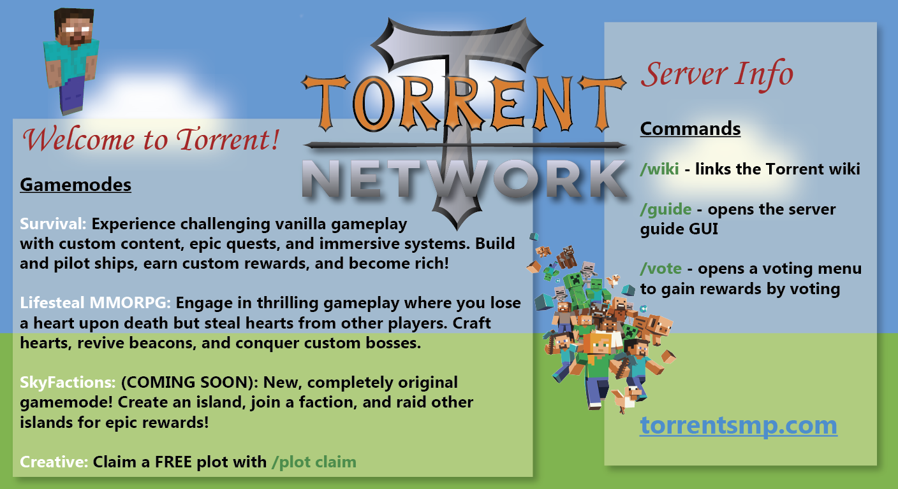

# Home

The Torrent Network is unique and experimental. Each server has its own quirks and offers content like you've never seen. Our servers are highly developed, and you will find a friendly, welcoming community here. You will find lore beyond your wildest imagination, helpful and professional staff, a polished finish to all of our systems, and a place you can call home.

<figure><figcaption></figcaption></figure>

This network supports all major versions on Java, as well as the latest version(s) on Bedrock! Feel free to join our [discord](https://dsc.gg/torrentsmp)!

Server IP: torrentsmp.com\
Bedrock port: 19132

