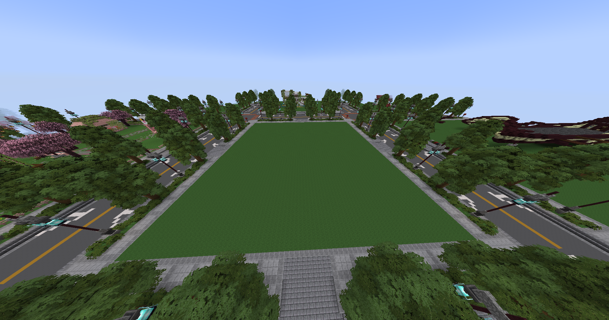
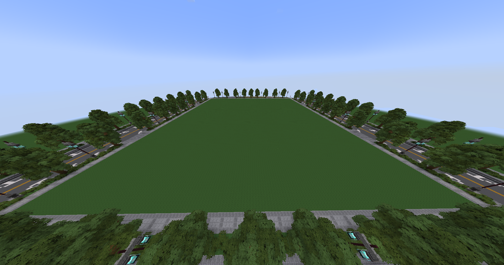
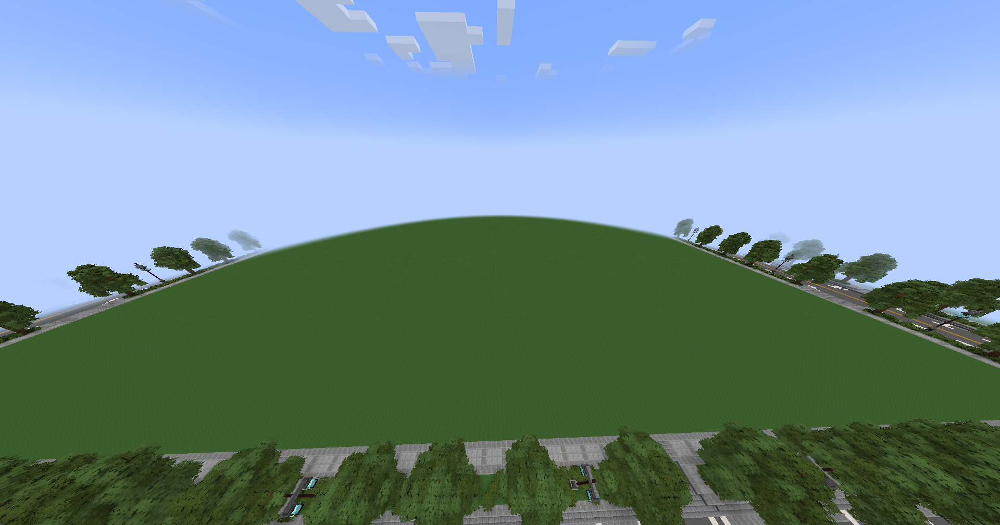
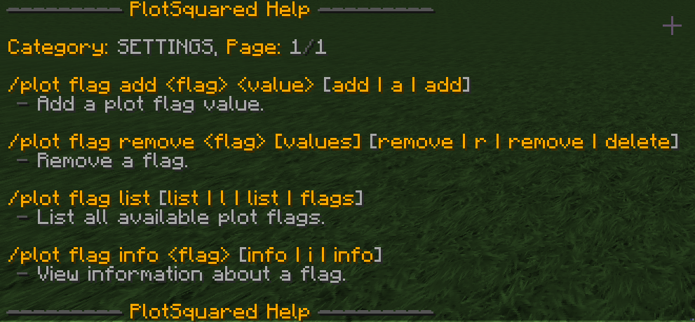

# Creative Plots


You can get more plots with builder rank or by purchasing a plot in our [webstore](https://torrent.tebex.io).


## Claiming a Plot

To claim a plot on this server, simply fly away from spawn and find a plot that is unclaimed. You can tell it's unclaimed because no title will pop up on screen. Then type `/plot claim`. It is worth noting these plots are 75x75, and you can claim one for free. For plots, or to claim a larger plot, you can buy upgrades in the [Torrent Webstore](https://torrent.tebex.io/category/creative-plots). There are three worlds total:

* Artoria - The default 75x75 plot world. Usage -> `/artoria`

<figure><figcaption>
Artoria
</figcaption></figure>

* Dorian - The medium sized 150x150 plot world. You must purchase a plot upgrade to claim a plot here. Usage -> `/dorian`&#x20;

<figure><figcaption>
Dorian
</figcaption></figure>

* Radioth - The large-sized 300x300 plot world; this is often used for building events. You must purchase a plot upgrade to claim a plot here. Usage -> `/radioth`&#x20;

<figure><figcaption>
Radioth
</figcaption></figure>

## Flags

You can set a flag in your plot using the following command: `/plot flag set <flag> <value>`

<figure><figcaption>
The plot flag help menu
</figcaption></figure>

For the full list of flags and their explanations, check out the [PlotSquared wiki](https://intellectualsites.gitbook.io/plotsquared/features/plot-flags).
