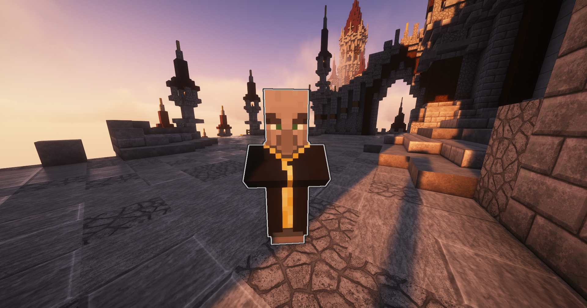
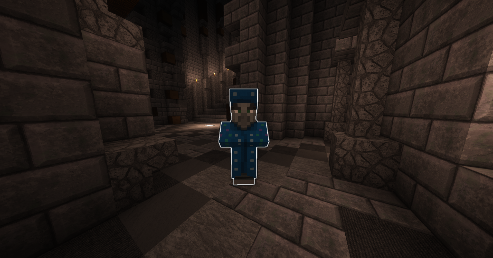
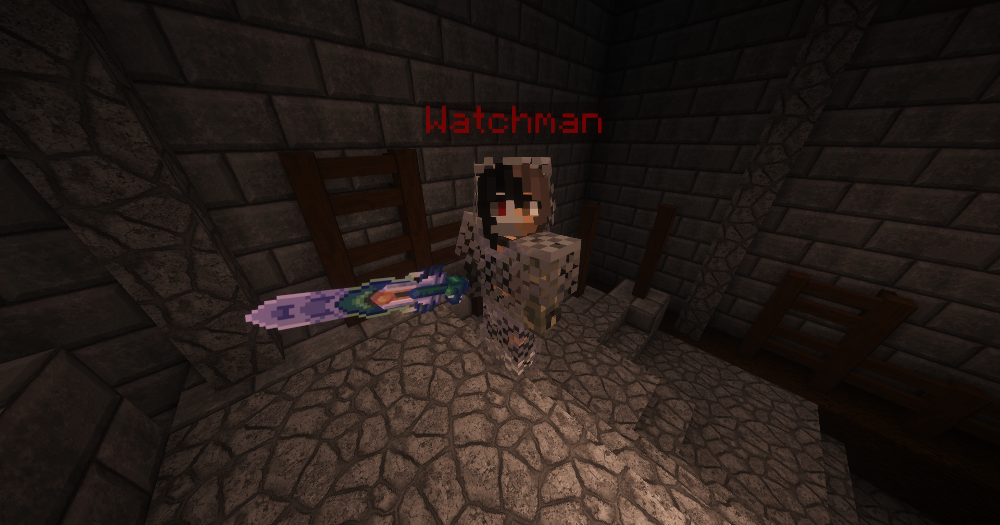
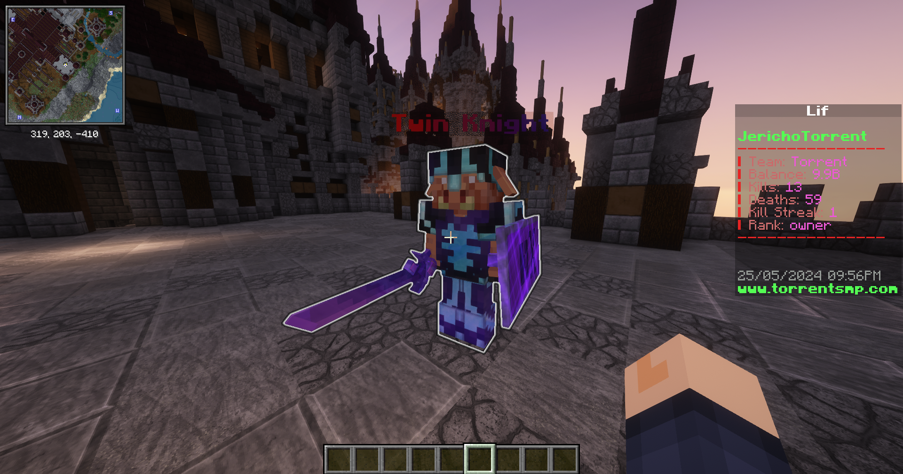
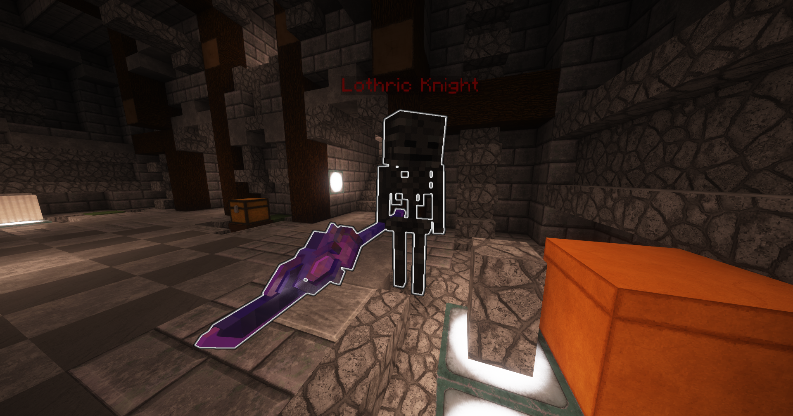
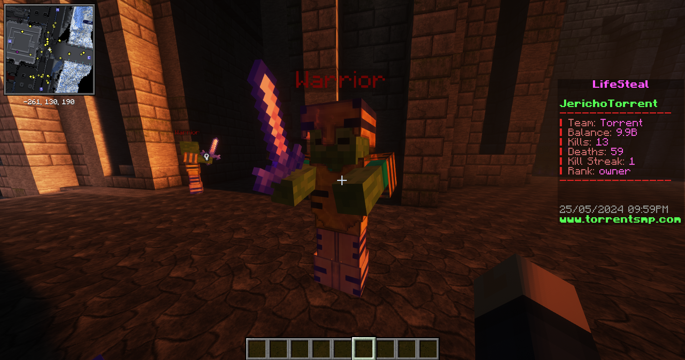
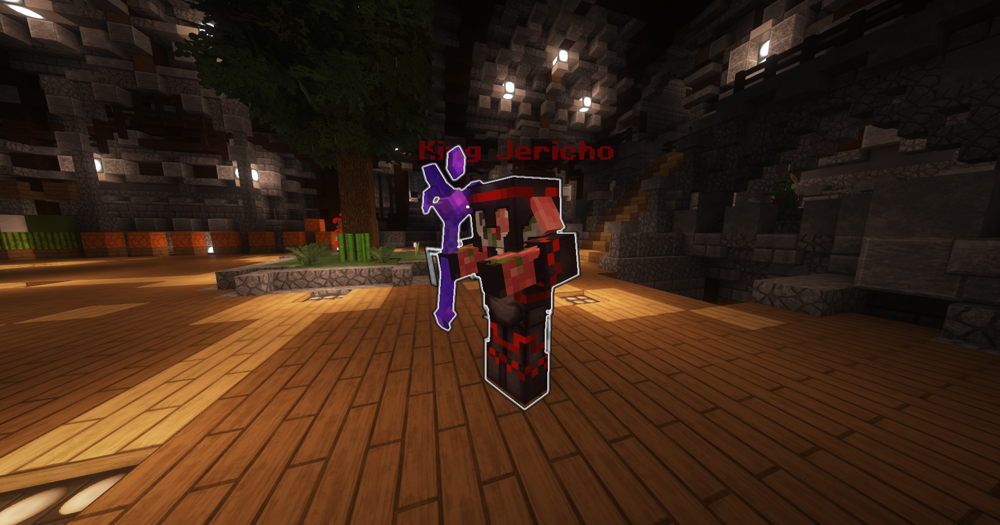
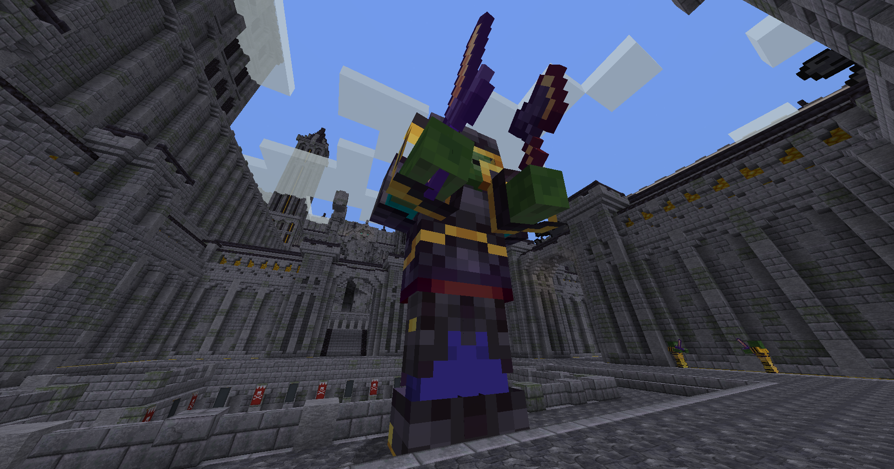
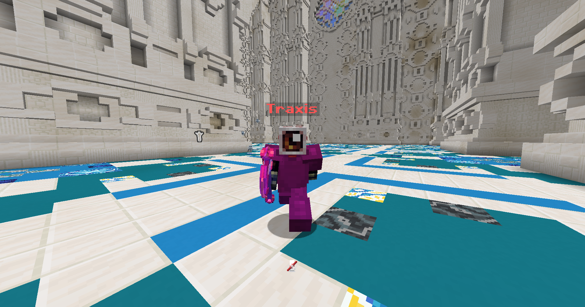

# Bosses

## Mini Bosses

### Chained Evokers

<figure><figcaption>
One of the 5 Chained Evokers
</figcaption></figure>

Location: Lothric Castle - Entrance

The Chained Evoker awaits the player at the entrance of the castle, just past the first staircase. This is a great place to farm their totems, but be careful. They have more health than a normal evoker and in a pack, they can be a deadly foe. Soon, dozens of vexes could be swarming you. This boss can be fought on day 1 after claiming a starter kit.

### Hollowed Prince

<figure><figcaption>
The Hollowed Prince awaiting his first victim.
</figcaption></figure>

Location: Lothric Castle - Forum

This mini-boss is a rite of passage for any player wishing to ascend the epic Lothric Castle. With his Illusioner's Bow, he strikes fear into his enemy's hearts, literally. Illusioners can be difficult to fight because they do what their name implies, cast illusions. I shall give you a hint: he isn't any of the clones you see. He is given away by the "bubbles" the come off from his hitbox. His true form is an invisible entity in between the illusions.

With 200 health, he's pretty much a tank. He drops the Illusioner's Bow to the player that does the most damage to him. The base bow has Power V, but can be enchanted further. If you defeat him, you may just well make it pretty far into the castle. Don't get overconfident just yet; he is quite weak compared to the other bosses.

### Watchmen

<figure><figcaption>
Guard(s) of the 4 concrentric towers around the castle.
</figcaption></figure>

Location: Lothric Castle - 4 Towers

The 4 watchmen guard the watchtowers around the castle, patrolling for intruders. Having guarded the towers for hundreds of years after the Convergence, the watchmen are decayed and decrepit, kept alive only by dark magic. They each have a chance at dropping the Slate Blade, imbued with gravitational magic. Take heed, they are fast, and if they spot you they can make quick work of you if you aren't prepared. They each gaurd a [loot chest](structures/loot-chests.md).

### Twin Knight

<figure><figcaption>
Twin Knight on patrol
</figcaption></figure>

Location: Lothric Castle - East and West Exterior Platforms

The two twin knights patroll the opposite outer terraces of the Lothric Castle. The twin knights are mutated by dark magic, and are highly trained warriors. They protect King Jericho from the exterior. They have a chance of dropping the Taboo Blade, an epic sword crafted by the dwarven blacksmiths of Haven, imbued with dark magic from the Slate Dimension. Be warned, this is a tough fight.

### Lothric Knight

<figure><figcaption>
The rotted and hollowed Lothric Knight
</figcaption></figure>

Location: Lothric Castle - Lower and Upper Interior Chambers

These ancient Knights are the oldest and most hollowed entities patrolling the castle. Only deep within the fortress can you find these mini-bosses. They have no intelligence nor awareness, yet fight by pure instinct. They drop the legendary Lothric Spear, which only those hollowed by dark magic can use. With their nimble bodies, they are fast and lethal.

### Crystalled Warrior

<figure><figcaption>
Crystalled Warrior guarding the entrance
</figcaption></figure>

Location: Crystalled Castle - Bridge and Entrance

The zombified warriors are not an easy fight. They are slow, yet tough. If you get cornered, you'll find over two dozen of these hulking zombies surrounding you. These mini-bosses are mutated and turned undead from the dark magic proliferation from the Slate Dimension.

## Main Bosses

### King Jericho

<figure><figcaption>
King Jericho, the ruler of the Kingdom of Torrent
</figcaption></figure>

Location: Lothric Castle - King's Chamber

The mythic ruler of Torrent King Jericho singlehandedly caused [The Convergence](../lore/the-convergence.md) that led to the state of the world today. Jericho has waited in the King's Chamber for hundreds of years, waiting for the return of the Artorian Empire to finally claim his bloodlusted revenge. This is the toughest fight on the server by far. It is advised to gear up substantially and gather friends before attempting this fight. He respawns once daily.

Jericho has many skills and abilities, and drops the most powerful rewards. He can summon minions from the Slate Dimension: Craven Souls. They are skiterring skeletons beaming enemies from afar with their tipped arrows, while Jericho demolishes them with his Hollowed Staff. The staff, bursting at the bolts with ancient forbidden magic, was able to cast the portal to the greater orbit of Haven long ago. This staff may very well someday be wielded by the new King of Torrent (it could be you!)

### Crystalled King

<figure><figcaption>
The giant Crystalled King
</figcaption></figure>

Location: Crystalled Castle Interior

The Crystalled King is a giant zombified entity. He was mutated into his incredibly large stature by an overflowing basin of ancient magic. He wields a sword and an axe, to hack and slash any sized foe. Guarded by his warriors and generals, it may be hard to even get close. Do not attempt to fight this boss without significant enhancements to your armor and weapons. He drops epic rewards and respawns once daily.

### Traxis

<figure><figcaption>
Traxis
</figcaption></figure>

Location: Cathedral Interior

Traxis is a demi-god warrior from the [Slate Dimension](../lore/the-convergence.md). He wields the epic Slate Axe, a legendary weapon able to be acquired by killing him. He has skills such as teleportation, launching you in the air, calling vexes to fight you, and many more. This is a HARD boss; very few players have defeated him. Many have lost hearts and given up. Can you step up to the plate and challenge this boss?
