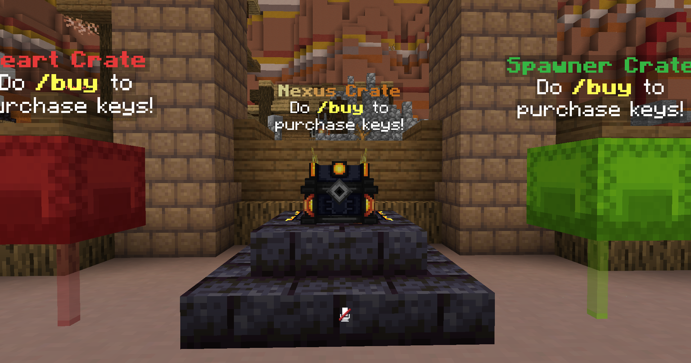
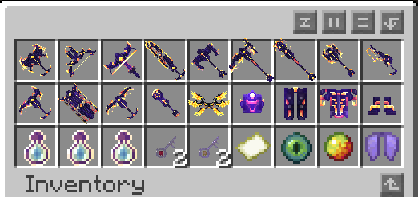
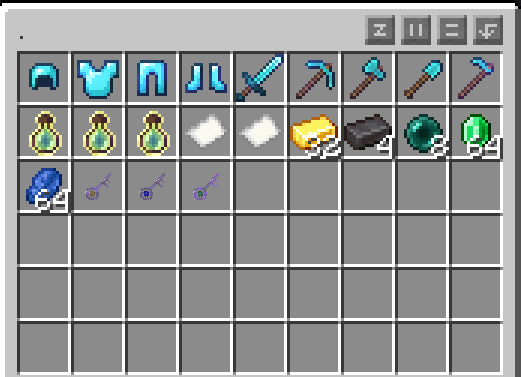
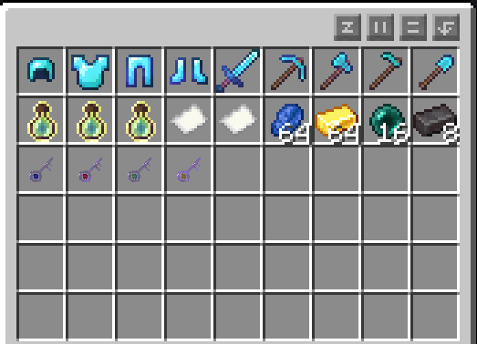
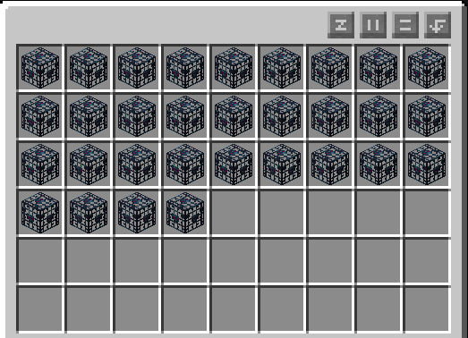
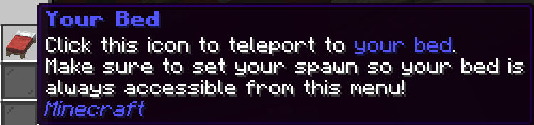
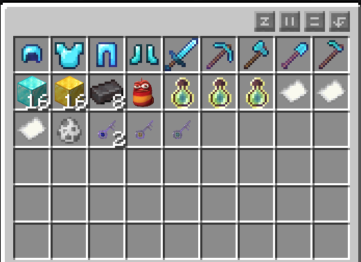
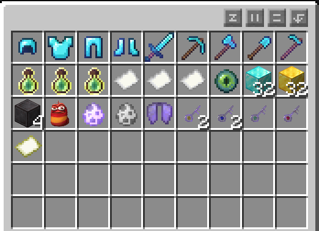

# Crates

Crates are located right in front of the world spawn point. Each crate contains many rewards. Check out our crate key packages in our [store](https://torrent.tebex.io). Each crate except the spawner crate and the heart crate contain a small probability of dropping keys to other crates. Each crate has one reward per unlock, save for the Nexus crate which has 3.

The most powerful crate by far, the Nexus crate contains the exclusive Nexus armor and tools set, heart items, revive crystals, and custom enchanting upgrades. This crate gives the most rewards per pull; you get 3 rewards for each key. Use `/buy` or visit our [webstore](https://torrent.tebex.io) to purchase a key.

## Nexus

The Nexus Crate is a mythical crate that produces 3 epic rewards per opening. You can purchase Nexus Keys in our [webstore](https://torrent.tebex.io/package/6420611).

<figure><figcaption>
Nexus Crates
</figcaption></figure>

<figure><figcaption>
Nexus Crate Rewards
</figcaption></figure>

## Vote

The vote crate contains rewards from [voting](../voting.md). You can use `/voteshop` to spend voting points, or open a vote crate with a key. The vote crate contains one reward per pull.

<figure><figcaption>
Vote Crate Rewards
</figcaption></figure>

## AFK

Going AFK in the AFK Pit can earn you rewards including money straight into your account, as well as AFK crate keys. The AFK crate contains one reward per pull.

<figure><figcaption>
AFK Crate Rewards
</figcaption></figure>

## Spawner

The spawner crate contains a plethora of spawners from many different mobs. Depending on which one you pull, this could be a game changer for you. Use `/buy` or visit our [webstore](https://torrent.tebex.io) to purchase a key.

<figure><figcaption>
Spawner Crate Rewards
</figcaption></figure>

## Heart

This crate contains an assortment of heart items, from heart fragments to a dozen full hearts. You get one reward per pull. Remember, the maximum heart limit is 20, but you can physically carry or store extra heart items and right click them to add them to your hearts when your limit is less than 20. Use `/buy` or visit our [webstore](https://torrent.tebex.io) to purchase a key.

<figure><figcaption>
Heart Crate Rewards
</figcaption></figure>

## Rare

The rare crate contains enchanted diamond armor, totems, XP, banknotes, Safari Nets, and more. You get one reward per pull of the rare crate key. Use `/buy` or visit our [webstore](https://torrent.tebex.io) to purchase a key.

<figure><figcaption>
Rare Crate Rewards
</figcaption></figure>

## Legendary

While not as powerful as the Lifesteal crate, the legendary crate has great rewards. It contains highly enchanted diamond gear, netherite blocks, half a stack of diamond blocks, banknotes, XP, and much more. You get one reward per pull of the legendary crate key. Use `/buy` or visit our [webstore](https://torrent.tebex.io) to purchase a key.

<figure><figcaption>
Legendary Crate Rewards
</figcaption></figure>
