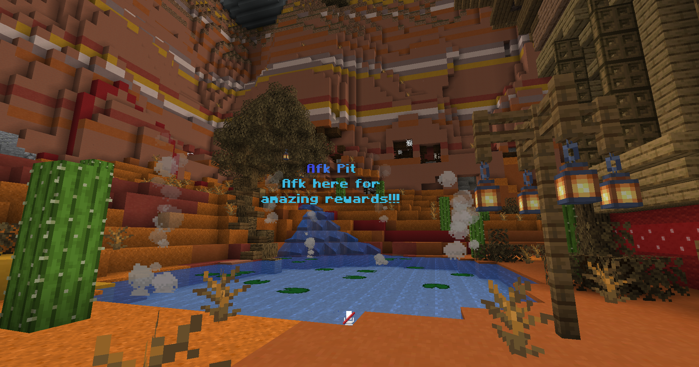

# Economy

## Shop

Our shop system allows Torrent Lifesteal players to buy and sell items to the server. We have disabled transactions involving potions, enchantments and spawners. The prices for items are similar or exactly the same as used on the Torrent SMP server.

Player Commands:&#x20;

`/shop` - Open the Shop GUI, allowing you to navigate the sectional categories. It also allows you to open the GUI directly to a specific section, such as `/shop redstone`

`/sellall` - Allows you to sell all of a given item in your inventory, such as `/sellall cobblestone`.&#x20;

`/sellall hand` - Sell all the items in your current hand (hotbar highlighted)

`/sellgui` - Opens an empty inventory where you can drop items to sell. Closing the GUI completes the transaction. Any items that could not be sold are automatically given back.

## AFK Pit

Torrent Lifesteal has an AFK Pit that rewards you for being AFK in a designated area under /spawn. Your rewards can include in-game money as well as crate keys allowing you to unlock epic rewards. There are no player commands to take advantage of the pit, and you'll receive an in-game title when you enter this area. Check out [crates](crates.md) for information about the AFK crate itself.

<figure><figcaption>
AFK Pit
</figcaption></figure>

## Auction House

Allows you to list items for sale to other players. You can bring up the GUI interface by typing /ah

Player Commands:&#x20;

`/ah search`&#x20;

`/ah sell` - Sell the item currently selected in your hand /ah selling - List the items you are currently selling.&#x20;

`/ah sold` - View the items you have sold recently.

`/ah expired` - View items that have expired.&#x20;

`/ah cancel` - Cancel ALL your auctions.&#x20;

`/ah return` - Drop all your cancelled and expired items to you.

## Bank Notes

The lifesteal server has certain rewards found on bosses and in chests that give you a bank note. Its worth is stated on the item. You can "use" the note to deposit the money into your `/money` account, or you can exchange/drop it to other players such as team members, or an MVP in a fight.

Player Commands:&#x20;

`/withdraw <amount>` - Allows you to create a bank note in the form of an item you can exchange or use. The minimum amount is $10.&#x20;

To deposit the bank note, right-click the currently held banknote or tap-hold on mobile devices.

## Kits

Torrent Lifesteal provides kits! An NPC at spawn will provide you with at least one kit every 60 minutes (starter kit.) The kit includes a full diamond armor set and weapon/toolset. You are also provided some golden apples and food. Everything you need to avoid or bypass spawn campers and get out into the wild!

You may go back to /spawn and obtain a new kit, even if your current kit is fully intact, allowing you to save up a few backup sets for PvP carnage. Tactical use of the kits can make a major difference in keeping you alive, use them wisely! While you're at `/spawn`, spend some time in the AFK Pit to earn rewards, or participate in the nearby King of the Hill competition.

## XP Bottles

You may store your experience for later use, trade it, or sell it on the auction house!

Player Commands:

`/xp` - Shows how much XP you have, your level, and how much more you need to level up.

`/xpbottle <amount>` - Withdraw your XP into an XP bottle to save for later. This is a great idea if you're about to get into a fight and you don't want to lose your XP when you die.
