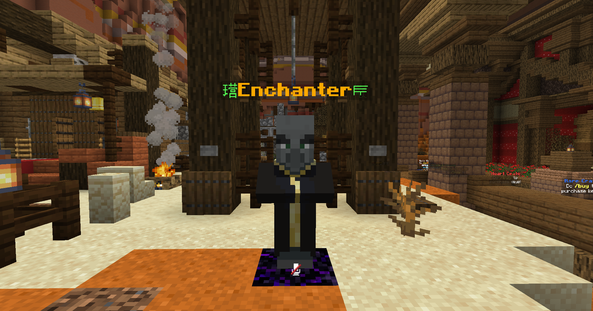

# Enchanting

By using the Enchanter NPC at spawn, you can purchase enchantments for your tools/armor using XP. This is a great way to spend XP you've gotten from crates or from killing bosses. These enchants are more unique and powerful than the default enchantments you get from enchantment tables or default Minecraft enchanted books. Click the enchantment to roll for a book. Then, drag the enchanted book and click your item in your inventory to attempt to apply the enchantment.

You can also gain custom enchantments from the Vanilla enchantment table, which has a 45% chance of having one of the enchantments in the [table](enchanting.md#enchantments-list).

## Enchanter

<figure><figcaption>
Enchanter NPC
</figcaption></figure>

To buy an enchantment, click on the Enchanter NPC at Spawn and purchase the enchantment from the UI. They are tiered from Simple to Legendary. Apply the enchantment to your gear by dragging the enchantment onto it in your inventory. **Be warned**; enchantments have probabilities of success or failure!!\
\
You can apply a total of 5 slots of custom enchants to your items. To increase these slots, you can use an **Elite Slot Increaser**, which you can only get from crates.

<figure><figcaption>
Enchanter UI
</figcaption></figure>

## Tinker

By clicking on the Enchanter NPC at spawn, you can open a tinker menu to tinker your gear with custom enchants. Put your item in the left side, and the Tinker can remove custom enchants and give you books or materials.

<figure><figcaption>
Tinker UI
</figcaption></figure>

## Alchemist

The Alchemist will exchange the following:

* 2x enchantment books of the same type and level = 1x enchantment book of higher level
* 2x magic dust of same rarity = 1x magic dust of higher chances

<figure><figcaption>
Alchemy UI
</figcaption></figure>

## Other Enchanting Items

### Elite Slot Increaser

Normally, you can only add 5 custom enchantments to an item. However, each elite slot increaser will add +1 slot to your item, up to 5 additional custom enchant slots. Featured in the [Nexus Crate](crates.md#nexus).

### Black Scroll

Removes a custom enchant from an item and converts it to a 100% success rate enchanted book.

### **Secret, Mystery and Magic Dust**

Increases the success rate of an enchantment while decreasing its failure rate. Sold in the [Heart Shop](economy.md#heart-shop).

### **BlockTrak**

Track the number of blocks broken by a tool. Sold in the Heart Shop.

### **StatTrak**

Track the number of kills from your weapon. Sold in the Heart Shop.

### **Holy White Scroll**

Prevent an item from dropping on death. **COMING SOON**

## Enchantments List

<table data-header-hidden><thead><tr><th width="156"></th><th width="209"></th><th width="189"></th><th width="127"></th><th width="72"></th></tr></thead><tbody><tr><td>Enchantment</td><td>Description</td><td>Applies to</td><td>Rarity</td><td>Max Level</td></tr><tr><td>Abiding</td><td>Weapons with this enchant become unbreakable</td><td>Weapons</td><td>Legendary</td><td>1</td></tr><tr><td>Aegis</td><td>Chance to gain speed when taking fall damage.</td><td>Boots</td><td>Ultimate</td><td>3</td></tr><tr><td>Allure</td><td>Your attack pulls mobs towards you.</td><td>Swords</td><td>Elite</td><td>3</td></tr><tr><td>Ambit</td><td>Damages mobs within a radius that increases with the level of enchant.</td><td>Swords, Axes</td><td>Ultimate</td><td>7</td></tr><tr><td>Auto Reel</td><td>Automatically reels in the fishing rod when it gets a bite.</td><td>Fishing Rods</td><td>Ultimate</td><td>4</td></tr><tr><td>Aquatic</td><td>Breathe underwater.</td><td>Helmets</td><td>Simple</td><td>1</td></tr><tr><td>Arrow Break</td><td>Chance for arrows to bounce off you while holding item with this enchant.</td><td>Axe</td><td>Ultimate</td><td>6</td></tr><tr><td>Arrow Deflect</td><td>Chance to prevent enemy arrow from dealing damage.</td><td>Armor</td><td>Ultimate</td><td>4</td></tr><tr><td>Bait</td><td>Chance to receive double fishing drops.</td><td>Fishing Rod</td><td>Legendary</td><td>3</td></tr><tr><td>Beastslayer</td><td>Increases damage dealt to Hostile Mobs.</td><td>Swords, Axes</td><td>Legendary</td><td>4</td></tr><tr><td>Blacksmith</td><td>Repair your weapon in exchange for dealing less damage.</td><td>Axe</td><td>Legendary</td><td>5</td></tr><tr><td>Bone Crusher</td><td>Increases damage dealt to Skeletons.</td><td>Swords, Axes</td><td>Simple</td><td>3</td></tr><tr><td>Carrot Planter</td><td>Plant carrots in a 3x3 area by shift+right-clicking.</td><td>Hoes</td><td>Simple</td><td>3</td></tr><tr><td>Confuse</td><td>Chance to give nausea effect.</td><td>Swords</td><td>Ultimate</td><td>4</td></tr><tr><td>Convulse</td><td>Chance to throw your attackers into the air.</td><td>Boots</td><td>Legendary</td><td>6</td></tr><tr><td>Creeper Armor</td><td>Chance to be immune to explosive damage, at higher levels you have a chance to heal.</td><td>Armor</td><td>Ultimate</td><td>3</td></tr><tr><td>Curse</td><td>Chance to give your enemy mining fatigue.</td><td>Armor</td><td>Elite</td><td>2</td></tr><tr><td>Deadshot</td><td>Headshots with tridents deal double damage.</td><td>Trident</td><td>Legendary</td><td>5</td></tr><tr><td>Death Punch</td><td>Increases damage dealt to Zombies.</td><td>Swords, Axes</td><td>Simple</td><td>5</td></tr><tr><td>Decapitation</td><td>Chance to have opponents head drop on death.</td><td>Swords, Axes</td><td>Simple</td><td>3</td></tr><tr><td>Devour</td><td>Chance to restore food while killing mobs.</td><td>Weapons</td><td>Unique</td><td>3</td></tr><tr><td>Diminish</td><td>Chance to give your enemy mining fatigue.</td><td>Axes</td><td>Ultimate</td><td>1</td></tr><tr><td>Disappear</td><td>Chance to become invisible when low on health.</td><td>Armor</td><td>Ultimate</td><td>4</td></tr><tr><td>Dodge</td><td>Chance to dodge physical enemy, chance increases when sneaking.</td><td>Armor</td><td>Ultimate</td><td>5</td></tr><tr><td>Double Strike</td><td>A chance to strike twice.</td><td>Swords</td><td>Legendary</td><td>3</td></tr><tr><td>Ender Slayer</td><td>Increases damage dealt to Enderman and Ender dragons.</td><td>Weapons</td><td>Elite</td><td>5</td></tr><tr><td>Endmaster</td><td>Double damage to mobs in End.</td><td>Swords</td><td>Ultimate</td><td>3</td></tr><tr><td>Epicness</td><td>Display particles on attack.</td><td>Swords</td><td>Simple</td><td>3</td></tr><tr><td>Exalted</td><td>A chance of removing bad potion effects.</td><td>Swords</td><td>Ultimate</td><td>4</td></tr><tr><td>Experience</td><td>Chance to get more experience from ores.</td><td>Tools</td><td>Simple</td><td>5</td></tr><tr><td>Explosive</td><td>Chance for arrows to explode.</td><td>Bow</td><td>Unique</td><td>5</td></tr><tr><td>Explosive Demise</td><td>Summon creepers as your guards when near death.</td><td>Leggings</td><td>Unique</td><td>8</td></tr><tr><td>Extinguish</td><td>Chance to extinguish yourself when on fire.</td><td>Leggings</td><td>Elite</td><td>3</td></tr><tr><td>Famine</td><td>A chance to give your opponent the hunger effect.</td><td>Weapons</td><td>Unique</td><td>4</td></tr><tr><td>Featherweight</td><td>Chance to get a burst of haste.</td><td>Swords, Axes</td><td>Unique</td><td>3</td></tr><tr><td>Forcefield</td><td>Chance to push away your opponent.</td><td>Swords</td><td>Simple</td><td>5</td></tr><tr><td>Frenzy</td><td>Chance for arrows to explode.</td><td>Crossbow</td><td>Unique</td><td>5</td></tr><tr><td>Frozen</td><td>Can cause slowness to attacker when defending.</td><td>Armor</td><td>Elite</td><td>3</td></tr><tr><td>Fire Hook</td><td>The hook is on fire.</td><td>Fishing Rod</td><td>Elite</td><td>3</td></tr><tr><td>Fuddle</td><td>Disorganize opponent's hotbar.</td><td>Swords</td><td>Ultimate</td><td>3</td></tr><tr><td>Fumble</td><td>Chance to explode enemy when hit by their arrows.</td><td>Chestplate</td><td>Legendary</td><td>3</td></tr><tr><td>Gears</td><td>Added speed when equipped.</td><td>Boots</td><td>Legendary</td><td>3</td></tr><tr><td>Glowing</td><td>Gives permanent night vision.</td><td>Helmet</td><td>Simple</td><td>1</td></tr><tr><td>Guardians</td><td>A chance to spawn iron golems to assist you and watch over you.</td><td>Armor</td><td>Ultimate</td><td>10</td></tr><tr><td>Hardened</td><td>Chance to recover durability when damaged by players.</td><td>Armor</td><td>Legendary</td><td>3</td></tr><tr><td>Hasten</td><td>Chance to gain Haste after breaking blocks.</td><td>Tools</td><td>Simple</td><td>3</td></tr><tr><td>Heavy</td><td>Decreases damage from enemy bows by 2% per level.</td><td>Armor</td><td>Ultimate</td><td>5</td></tr><tr><td>Hook</td><td>Get more exp from fishing.</td><td>Fishing Rod</td><td>Elite</td><td>3</td></tr><tr><td>Hunter</td><td>Increases damage dealt to Passive Mobs.</td><td>Bow, Crossbow, Trident</td><td>Unique</td><td>4</td></tr><tr><td>Ice Aspect</td><td>A chance of causing the slowness effect on your enemy.</td><td>Swords</td><td>Ultimate</td><td>3</td></tr><tr><td>Immolate</td><td>Increases damage dealt to Spiders.</td><td>Swords, Axes</td><td>Elite</td><td>3</td></tr><tr><td>Immolation</td><td>Set all mobs in radius on fire.</td><td>Swords</td><td>Ultimate</td><td>3</td></tr><tr><td>Implants</td><td>Chance to restore food every few seconds.</td><td>Helmets</td><td>Ultimate</td><td>3</td></tr><tr><td>Infernal</td><td>Explosive fire effect.</td><td>Swords, Axes</td><td>Elite</td><td>3</td></tr><tr><td>Inquisitive</td><td>Chance to increase EXP drops from mobs.</td><td>Swords</td><td>Legendary</td><td>4</td></tr><tr><td>Interrupt</td><td>Chance to give your enemy mining fatigue.</td><td>Swords</td><td>Ultimate</td><td>2</td></tr><tr><td>Jelly Legs</td><td>Chance to negate fall damage.</td><td>Boots</td><td>Ultimate</td><td>3</td></tr><tr><td>Kill Aura</td><td>Chance to kill multiple monsters in radius.</td><td>Swords</td><td>Legendary</td><td>5</td></tr><tr><td>Launch</td><td>Launch yourself by right-clicking.</td><td>Swords</td><td>Legendary</td><td>3</td></tr><tr><td>Lucid</td><td>Chance to cure blindness and gain night vision when hit.</td><td>Armor</td><td>Legendary</td><td>3</td></tr><tr><td>Momentum</td><td>Chance to gain speed boost with fireworks.</td><td>Elytra</td><td>Elite</td><td>3</td></tr><tr><td>Nether Slayer</td><td>Increases damage dealt to nether mobs.</td><td>Weapons</td><td>Elite</td><td>5</td></tr><tr><td>Netherling</td><td>Double damage to mobs in Nether.</td><td>Swords</td><td>Ultimate</td><td>3</td></tr><tr><td>Night Owl</td><td>Deal more damage to mobs at night.</td><td>Swords</td><td>Ultimate</td><td>1</td></tr><tr><td>Nightwalker</td><td>Freeze mobs at night.</td><td>Swords</td><td>Elite</td><td>3</td></tr><tr><td>Obsidianshield</td><td>Gives permanent fire resistance.</td><td>Armor</td><td>Ultimate</td><td>1</td></tr><tr><td>Paralyze</td><td>Gives lightning effect and a chance for slowness and slow swinging.</td><td>Swords, Axes</td><td>Elite</td><td>4</td></tr><tr><td>Patch</td><td>Chance to recover durability when damaged by mobs.</td><td>Armor</td><td>Legendary</td><td>3</td></tr><tr><td>Perish</td><td>A chance to give the wither effect.</td><td>Bow, Crossbow, Trident</td><td>Unique</td><td>5</td></tr><tr><td>Planter</td><td>Plant seeds in a 3x3 area by shift+right-clicking.</td><td>Hoes</td><td>Ultimate</td><td>3</td></tr><tr><td>Plummet</td><td>Deal damage to nearby mobs when taking fall damage.</td><td>Boots</td><td>Ultimate</td><td>3</td></tr><tr><td>Poison</td><td>A chance of giving poison effect.</td><td>Swords, Axes</td><td>Elite</td><td>3</td></tr><tr><td>Poisoned Hook</td><td>Poisons the hook.</td><td>Fishing Rod</td><td>Elite</td><td>3</td></tr><tr><td>Poisoned</td><td>Chance to poison your attacker.</td><td>Armor</td><td>Elite</td><td>4</td></tr><tr><td>Potato Planter</td><td>Plant potatoes in a 3x3 area by shift+right-clicking.</td><td>Hoes</td><td>Simple</td><td>3</td></tr><tr><td>Proharvester</td><td>Only harvests fully grown crops</td><td>Hoes, Axes</td><td>Unique</td><td>1</td></tr><tr><td>Ragdoll</td><td>Chance to be pushed back when getting hit.</td><td>Armor</td><td>Ultimate</td><td>4</td></tr><tr><td>Ravenous</td><td>Chance to regain hunger while fighting.</td><td>Swords, Axes</td><td>Unique</td><td>4</td></tr><tr><td>Rebound</td><td>Gain some health back after kills.</td><td>Weapons</td><td>Legendary</td><td>3</td></tr><tr><td>Rebreather</td><td>Chance to regain air when mining under water.</td><td>Pickaxe</td><td>Simple</td><td>2</td></tr><tr><td>Reforged</td><td>Protects weapons and tools durability, items will be take longer to break.</td><td>Weapons and tools</td><td>Elite</td><td>10</td></tr><tr><td>Reinforced</td><td>Reduces damage dealt to you.</td><td>Elytra</td><td>Ultimate</td><td>4</td></tr><tr><td>Replanter</td><td>Replants crops when harvested</td><td>Hoes</td><td>Unique</td><td>1</td></tr><tr><td>Replenish</td><td>Chance to restore food while mining.</td><td>Pickaxes</td><td>Elite</td><td>3</td></tr><tr><td>Rocket Escape</td><td>Blast off into the air at low HP.</td><td>Boots</td><td>Elite</td><td>3</td></tr><tr><td>Shatter</td><td>Chance to deal extra durability damage to all enemy armor with every attack.</td><td>Axes</td><td>Ultimate</td><td>4</td></tr><tr><td>Sharpness Hook</td><td>Deal damage with the hook.</td><td>Fishing Rod</td><td>Ultimate</td><td>1</td></tr><tr><td>Shockwave</td><td>Chance to push back your attacker when your health is low.</td><td>Chestplates</td><td>Elite</td><td>5</td></tr><tr><td>Slayer</td><td>Increases damage dealt to Passive Mobs.</td><td>Swords, Axes</td><td>Unique</td><td>4</td></tr><tr><td>Slingshot</td><td>Boost yourself into flight by right-clicking.</td><td>Elytra</td><td>Legendary</td><td>3</td></tr><tr><td>Smelting</td><td>Chance to smelt mined blocks.</td><td>Pickaxes, Axes, Shovels</td><td>Simple</td><td>3</td></tr><tr><td>Smoke Bomb</td><td>When you are near death, you will spawn a smoke bomb to distract your enemies.</td><td>Helmet</td><td>Elite</td><td>8</td></tr><tr><td>Snap</td><td>Pull hit entity towards you.</td><td>Fishing Rod</td><td>Elite</td><td>3</td></tr><tr><td>Snare</td><td>Chance to slow and fatigue enemies with projectiles.</td><td>Bows</td><td>Elite</td><td>4</td></tr><tr><td>Soulless</td><td>Increases damage dealt to Hostile Mobs.</td><td>Bow, Crossbow, Trident</td><td>Unique</td><td>4</td></tr><tr><td>Spirits</td><td>Chance to spawn guard blazes.</td><td>Armor</td><td>Ultimate</td><td>10</td></tr><tr><td>Springs</td><td>Gives jump boost.</td><td>Boots</td><td>Elite</td><td>3</td></tr><tr><td>Suspend</td><td>Chance to not cause any knockback effect to mobs.</td><td>Swords</td><td>Elite</td><td>3</td></tr><tr><td>Telepathy</td><td>Automatically places blocks broken by tools in your inventory.</td><td>Tools</td><td>Unique</td><td>4</td></tr><tr><td>Thunderlord</td><td>Strike monsters with lightning every 3 consecutive hits.</td><td>Weapons</td><td>Legendary</td><td>3</td></tr><tr><td>Timber</td><td>Chance to break a tree in one hit</td><td>Axes</td><td>Ultimate</td><td>3</td></tr><tr><td>Trickster</td><td>When hit you have a chance to teleport directly behind you opponent.</td><td>Armor</td><td>Elite</td><td>8</td></tr><tr><td>Turmoil</td><td>Chance to prevent opponents guards from spawning.</td><td>Armor</td><td>Legendary</td><td>3</td></tr><tr><td>Undead Ruse</td><td>When hit you have a chance to spawn zombie hordes to distract and disorient your opponents.</td><td>Boots</td><td>Elite</td><td>10</td></tr><tr><td>Vampire</td><td>A chance to heal you for up to 3hp a few seconds after you strike.</td><td>Swords</td><td>Elite</td><td>3</td></tr><tr><td>Vein Miner</td><td>Mine entire vein of ores</td><td>Pickaxes</td><td>Elite</td><td>3</td></tr><tr><td>Virus</td><td>A chance of giving poison effect.</td><td>Bow, Crossbow, Trident</td><td>Unique</td><td>3</td></tr><tr><td>Voodoo</td><td>Gives a chance to deal weakness.</td><td>Armor</td><td>Elite</td><td>6</td></tr><tr><td>Water Walker</td><td>Walk on Water.</td><td>Boots</td><td>Legendary</td><td>1</td></tr><tr><td>Wings</td><td>Allows flying when worn.</td><td>Boots</td><td>Fabled</td><td>1</td></tr></tbody></table>

<table><thead><tr><th width="151">Enchantment</th><th width="187">Description</th><th width="165">Applies to</th><th width="92">Rarity</th><th width="89">Max Level</th></tr></thead><tbody><tr><td>Shuffle</td><td>Shuffles opponent's hotbar.</td><td>Armor</td><td>Simple</td><td>3</td></tr><tr><td>Commander</td><td>Nearby allies are given haste.</td><td>Armor</td><td>Unique</td><td>5</td></tr><tr><td>Sustain</td><td>Chance to regain hunger when getting hit.</td><td>Armor</td><td>Unique</td><td>4</td></tr><tr><td>Cactus</td><td>Injures your attacker but does not affect your durability.</td><td>Armor</td><td>Elite</td><td>2</td></tr><tr><td>Curse</td><td>Chance to give your enemy mining fatigue.</td><td>Armor</td><td>Elite</td><td>2</td></tr><tr><td>Frozen</td><td>Can cause slowness to attacker when defending.</td><td>Armor</td><td>Elite</td><td>3</td></tr><tr><td>Hardened</td><td>Armor takes less durability damage.</td><td>Armor</td><td>Elite</td><td>3</td></tr><tr><td>Poisoned</td><td>Chance to give poison to your attacker.</td><td>Armor</td><td>Elite</td><td>4</td></tr><tr><td>Trickster</td><td>When hit you have a chance to teleport directly behind your opponent and take them by surprise.</td><td>Armor</td><td>Elite</td><td>8</td></tr><tr><td>Voodoo</td><td>Gives a chance to deal weakness.</td><td>Armor</td><td>Elite</td><td>6</td></tr><tr><td>Creeper Armor</td><td>Immune to explosive damage, at higher levels you take no knockback from them and they have a chance to heal you.</td><td>Armor</td><td>Ultimate</td><td>3</td></tr><tr><td>Creeper Armor</td><td>Chance to be immune to explosive damage, at higher levels you have a chance to heal.</td><td>Armor</td><td>Ultimate</td><td>3</td></tr><tr><td>Demonic</td><td>A chance to remove fire resistance from your enemy.</td><td>Armor</td><td>Ultimate</td><td>3</td></tr><tr><td>Disappear</td><td>Chance to become invisible when low on health.</td><td>Armor</td><td>Ultimate</td><td>4</td></tr><tr><td>Dodge</td><td>Chance to dodge physical enemy attacks, increased chance if sneaking.</td><td>Armor</td><td>Ultimate</td><td>5</td></tr><tr><td>Guardians</td><td>A chance to spawn iron golems to assist you and watch over you.</td><td>Armor</td><td>Ultimate</td><td>10</td></tr><tr><td>Obsidianshield</td><td>Gives permanent fire resistance.</td><td>Armor</td><td>Ultimate</td><td>1</td></tr><tr><td>Ragdoll</td><td>Chance to be pushed back when getting hit.</td><td>Armor</td><td>Ultimate</td><td>4</td></tr><tr><td>Reinforced</td><td>Take less damage when being hit from behind.</td><td>Armor</td><td>Ultimate</td><td>4</td></tr><tr><td>Safeguard</td><td>Chance to gain Damage Resistance when defending.</td><td>Armor</td><td>Ultimate</td><td>2</td></tr><tr><td>Spirits</td><td>Chance to spawn guard blazes.</td><td>Armor</td><td>Ultimate</td><td>10</td></tr><tr><td>Swordsman</td><td>Chance to reduces incoming damage while wielding a sword by up to 22% at max level.</td><td>Armor</td><td>Ultimate</td><td>5</td></tr><tr><td>Valor</td><td>Reduces incoming damage while wielding a sword by up to 22.5%.</td><td>Armor</td><td>Ultimate</td><td>5</td></tr><tr><td>Clarity</td><td>Immune to blindness.</td><td>Armor</td><td>Legendary</td><td>3</td></tr><tr><td>Hardened</td><td>Chance to recover durability when damaged by players.</td><td>Armor</td><td>Legendary</td><td>3</td></tr><tr><td>Lucid</td><td>Chance to cure blindness and gain night vision when hit.</td><td>Armor</td><td>Legendary</td><td>3</td></tr><tr><td>Patch</td><td>Chance to recover durability when damaged by mobs.</td><td>Armor</td><td>Legendary</td><td>3</td></tr><tr><td>Protection</td><td>Automatically heals and buffs all nearby faction allies.</td><td>Armor</td><td>Legendary</td><td>5</td></tr><tr><td>Surprise</td><td>Chance to teleport behind your opponent and take them by surprise.</td><td>Armor</td><td>Legendary</td><td>4</td></tr><tr><td>Turmoil</td><td>Chance to prevent opponents guards from spawning.</td><td>Armor</td><td>Legendary</td><td>3</td></tr><tr><td>Pummel</td><td>Chance to slow nearby enemy players for a short period.</td><td>Axe</td><td>Elite</td><td>3</td></tr><tr><td>Reaper</td><td>A chance to give your opponent the Wither and Blindness effects while dealing damage</td><td>Axe</td><td>Elite</td><td>4</td></tr><tr><td>Reaper</td><td>A chance to give your opponent the Wither and Blindness effects while dealing damage</td><td>Axe</td><td>Elite</td><td>4</td></tr><tr><td>Annihilate</td><td>Demolish your opponent's armour quicker!</td><td>Axe</td><td>Ultimate</td><td>6</td></tr><tr><td>Arrow Break</td><td>Chance for arrows to bounce off and do no damage to you whenever you are wielding an axe with this enchantment on it.</td><td>Axe</td><td>Ultimate</td><td>6</td></tr><tr><td>Arrow Break</td><td>Chance for arrows to bounce off you while holding item with this enchant.</td><td>Axe</td><td>Ultimate</td><td>6</td></tr><tr><td>Corrupt</td><td>Damage with niche, this enchant deals damage over time.</td><td>Axe</td><td>Ultimate</td><td>4</td></tr><tr><td>Blacksmith</td><td>Chance to heal your most damaged piece of armor by 1-2 durability whenever you hit a player, but when it procs your attack will only deal 50% of the normal damage.</td><td>Axe</td><td>Legendary</td><td>5</td></tr><tr><td>Blacksmith</td><td>Repair your weapon in exchange for dealing less damage.</td><td>Axe</td><td>Legendary</td><td>5</td></tr><tr><td>Devour</td><td>Multiplies damage dealt to players with active bleed stacks.</td><td>Axe</td><td>Legendary</td><td>4</td></tr><tr><td>Insanity</td><td>You swing your axe like a maniac. Multiplies damage against players who are wielding a SWORD at the time they are hit.</td><td>Axe</td><td>Legendary</td><td>8</td></tr><tr><td>Bleed</td><td>Applies bleed stacks to enemies that decrease their movement speed.</td><td>Axeaw</td><td>Ultimate</td><td>6</td></tr><tr><td>Confusion</td><td>A chance to deal nausea to your victim.</td><td>Axes</td><td>Simple</td><td>3</td></tr><tr><td>Decapitation</td><td>Victims have a chance of dropping their head on death.</td><td>Axes</td><td>Simple</td><td>3</td></tr><tr><td>Berserk</td><td>A chance of strength and mining fatigue.</td><td>Axes</td><td>Unique</td><td>5</td></tr><tr><td>Ravenous</td><td>Chance to regain hunger whilst in combat.</td><td>Axes</td><td>Unique</td><td>4</td></tr><tr><td>Blunt Force</td><td>Chance to strike with great force.</td><td>Axes</td><td>Elite</td><td>4</td></tr><tr><td>aw</td><td>Damages players within a radius that increases with the level of enchant.</td><td>Axes</td><td>Ultimate</td><td>7</td></tr><tr><td>Bleed</td><td>Make your opponent bleed.</td><td>Axes</td><td>Ultimate</td><td>6</td></tr><tr><td>Blessed</td><td>A chance of removing debuffs.</td><td>Axes</td><td>Ultimate</td><td>4</td></tr><tr><td>Cleave</td><td>Damages players within a radius that increases with the level of enchant.</td><td>Axes</td><td>Ultimate</td><td>7</td></tr><tr><td>Diminish</td><td>Chance to give your enemy mining fatigue.</td><td>Axes</td><td>Ultimate</td><td>1</td></tr><tr><td>Shatter</td><td>Chance to deal extra durability damage to all enemy armor with every attack.</td><td>Axes</td><td>Ultimate</td><td>4</td></tr><tr><td>Timber</td><td>Chance to break a tree in one hit</td><td>Axes</td><td>Ultimate</td><td>3</td></tr><tr><td>Barbarian</td><td>Inflicts more axe damage.</td><td>Axes</td><td>Legendary</td><td>4</td></tr><tr><td>Barbarian</td><td>Chance to inflict more axe damage.</td><td>Axes</td><td>Legendary</td><td>4</td></tr><tr><td>Hex</td><td>Once a target is affected by Hex, a portion of all their outgoing damage is reflected back onto them.</td><td>Axes</td><td>Legendary</td><td>4</td></tr><tr><td>Inflame</td><td>Set all players in radius on fire.</td><td>Axes</td><td>Legendary</td><td>3</td></tr><tr><td>Anti Gravity</td><td>Super jump.</td><td>Boots</td><td>Elite</td><td>3</td></tr><tr><td>Rocket Escape</td><td>Blast off into the air at low HP.</td><td>Boots</td><td>Elite</td><td>3</td></tr><tr><td>Rocket Escape</td><td>Blast off into the air at low HP.</td><td>Boots</td><td>Elite</td><td>3</td></tr><tr><td>Springs</td><td>Gives jump boost.</td><td>Boots</td><td>Elite</td><td>3</td></tr><tr><td>Springs</td><td>Gives jump boost.</td><td>Boots</td><td>Elite</td><td>3</td></tr><tr><td>Undead Ruse</td><td>When hit you have a chance to spawn zombie hordes to distract and disorient your opponents.</td><td>Boots</td><td>Elite</td><td>10</td></tr><tr><td>Undead Ruse</td><td>When hit you have a chance to spawn zombie hordes to distract and disorient your opponents.</td><td>Boots</td><td>Elite</td><td>10</td></tr><tr><td>Aegis</td><td>Chance to gain speed when taking fall damage.</td><td>Boots</td><td>Ultimate</td><td>3</td></tr><tr><td>Ender Walker</td><td>Wither and Poison do not injure and have a chance to heal at high levels.</td><td>Boots</td><td>Ultimate</td><td>5</td></tr><tr><td>Jelly Legs</td><td>Chance to negate fall damage.</td><td>Boots</td><td>Ultimate</td><td>3</td></tr><tr><td>Metaphysical</td><td>A chance to be immune of Slowness. At max level, you will only be affected approx. 10% of the time.</td><td>Boots</td><td>Ultimate</td><td>4</td></tr><tr><td>Plummet</td><td>Deal damage to nearby mobs when taking fall damage.</td><td>Boots</td><td>Ultimate</td><td>3</td></tr><tr><td>Convulse</td><td>Chance to throw your attackers into the air.</td><td>Boots</td><td>Legendary</td><td>6</td></tr><tr><td>Gears</td><td>Added speed when equipped.</td><td>Boots</td><td>Legendary</td><td>3</td></tr><tr><td>Quiver</td><td>Chance to fling your attackers into the air.</td><td>Boots</td><td>Legendary</td><td>6</td></tr><tr><td>Take Off</td><td>Allows flying when worn.</td><td>Boots</td><td>Legendary</td><td>1</td></tr><tr><td>Water Walker</td><td>Walk on Water.</td><td>Boots</td><td>Legendary</td><td>1</td></tr><tr><td>Wings</td><td>Allows flying when worn.</td><td>Boots</td><td>Legendary</td><td>1</td></tr><tr><td>Farcast</td><td>Chance to knockback melee attackers by a couple of blocks when they hit you. The lower your health, the higher the chance to proc.</td><td>Bow</td><td>Elite</td><td>5</td></tr><tr><td>Hijack</td><td>Chance to convert summoned enemy Guardians into your own when they are shot with an arrow.</td><td>Bow</td><td>Elite</td><td>4</td></tr><tr><td>Eagle Eye</td><td>Chance to deal 1-4 durability damage to ALL armor pieces of enemy player.</td><td>Bow</td><td>Ultimate</td><td>5</td></tr><tr><td>Hellfire</td><td>All arrows shot by you turn into explosive fireballs.</td><td>Bow</td><td>Ultimate</td><td>5</td></tr><tr><td>Pacify</td><td>A chance to pacify your target, preventing them from building rage stacks for 1-3 seconds depending on level.</td><td>Bow</td><td>Ultimate</td><td>4</td></tr><tr><td>Unfocus</td><td>Chance to Unfocus target player, reducing their out going bow damage by 50% for up to 10 seconds.</td><td>Bow</td><td>Ultimate</td><td>5</td></tr><tr><td>Hunter</td><td>Increases damage dealt to Passive Mobs.</td><td>Bow, Crossbow, Trident</td><td>Unique</td><td>4</td></tr><tr><td>Soulless</td><td>Increases damage dealt to Hostile Mobs.</td><td>Bow, Crossbow, Trident</td><td>Unique</td><td>4</td></tr><tr><td>Virus</td><td>A chance of giving poison effect.</td><td>Bow, Crossbow, Trident</td><td>Unique</td><td>3</td></tr><tr><td>Explosive</td><td>Explosive arrows.</td><td>Bows</td><td>Unique</td><td>5</td></tr><tr><td>Snare</td><td>Chance to slow and fatigue enemies with projectiles.</td><td>Bows</td><td>Elite</td><td>4</td></tr><tr><td>Venom</td><td>A chance of dealing poison.</td><td>Bows</td><td>Elite</td><td>3</td></tr><tr><td>Curse</td><td>Gives strength, slowness and resistance at low hp.</td><td>Chestplate</td><td>Unique</td><td>5</td></tr><tr><td>Shockwave</td><td>The chance to push back your attacker when your health is low.</td><td>Chestplate</td><td>Elite</td><td>5</td></tr><tr><td>Fumble</td><td>Chance to explode enemy when hit by their arrows.</td><td>Chestplate</td><td>Legendary</td><td>3</td></tr><tr><td>Shockwave</td><td>Chance to push back your attacker when your health is low.</td><td>Chestplates</td><td>Elite</td><td>5</td></tr><tr><td>Frenzy</td><td>Chance for arrows to explode.</td><td>Crossbow</td><td>Unique</td><td>5</td></tr><tr><td>Momentum</td><td>Chance to gain speed boost with fireworks.</td><td>Elytra</td><td>Elite</td><td>3</td></tr><tr><td>Slingshot</td><td>Boost yourself into flight by right-clicking.</td><td>Elytra</td><td>Legendary</td><td>3</td></tr><tr><td>Fire Hook</td><td>The hook is on fire.</td><td>Fishing Rod</td><td>Elite</td><td>3</td></tr><tr><td>Hook</td><td>Get more exp from fishing.</td><td>Fishing Rod</td><td>Elite</td><td>3</td></tr><tr><td>Poisoned Hook</td><td>Poisons the hook.</td><td>Fishing Rod</td><td>Elite</td><td>3</td></tr><tr><td>Snap</td><td>Pull hit entity towards you.</td><td>Fishing Rod</td><td>Elite</td><td>3</td></tr><tr><td>Sharpness Hook</td><td>Deal damage with the hook.</td><td>Fishing Rod</td><td>Ultimate</td><td>1</td></tr><tr><td>Bait</td><td>Chance to receive double fishing drops.</td><td>Fishing Rod</td><td>Legendary</td><td>3</td></tr><tr><td>Auto Reel</td><td>Automatically reels in the fishing rod when it gets a bite.</td><td>Fishing Rods</td><td>Ultimate</td><td>4</td></tr><tr><td>Glowing</td><td>Gives permanent night vision.</td><td>Helmet</td><td>Simple</td><td>1</td></tr><tr><td>Smoke Bomb</td><td>When you are near death, you will spawn a smoke bomb to distract your enemies.</td><td>Helmet</td><td>Elite</td><td>8</td></tr><tr><td>Destruction</td><td>Automatically damages and debuffs all nearby enemies.</td><td>Helmet</td><td>Legendary</td><td>5</td></tr><tr><td>Drunk</td><td>Slowness and slow swinging with a chance to get strength.</td><td>Helmet</td><td>Legendary</td><td>4</td></tr><tr><td>EnderShift</td><td>Gives speed/health boost at low hp.</td><td>Helmet Boots</td><td>Unique</td><td>3</td></tr><tr><td>Aquatic</td><td>Gives permanent water breathing.</td><td>Helmets</td><td>Simple</td><td>1</td></tr><tr><td>Implants</td><td>Passively heals 1 health and restores 1 hunger every few seconds</td><td>Helmets</td><td>Ultimate</td><td>3</td></tr><tr><td>Carrot Planter</td><td>Plant carrots in a 3x3 area by shift+right-clicking.</td><td>Hoes</td><td>Simple</td><td>3</td></tr><tr><td>Potato Planter</td><td>Plant potatoes in a 3x3 area by shift+right-clicking.</td><td>Hoes</td><td>Simple</td><td>3</td></tr><tr><td>Replanter</td><td>Replants crops when harvested</td><td>Hoes</td><td>Unique</td><td>1</td></tr><tr><td>Planter</td><td>Plant seeds in a 3x3 area by shift+right-clicking.</td><td>Hoes</td><td>Ultimate</td><td>3</td></tr><tr><td>Explosive Demise</td><td>Summon creepers as your guards when near death.</td><td>Leggings</td><td>Unique</td><td>8</td></tr><tr><td>Plague Carrier</td><td>When near death summons creepers and debuffs to avenge you.</td><td>Leggings</td><td>Unique</td><td>8</td></tr><tr><td>Extinguish</td><td>Chance to extinguish yourself when on fire.</td><td>Leggings</td><td>Elite</td><td>3</td></tr><tr><td>Exterminator</td><td>Temporarily disables enemy ability to use Undead Ruse, Gaurdians, and Spirits.</td><td>Leggings</td><td>Legendary</td><td>3</td></tr><tr><td>Oxygenate</td><td>Refills oxygen levels when breaking blocks under water.</td><td>Pickaxe</td><td>Simple</td><td>1</td></tr><tr><td>Rebreather</td><td>Chance to regain air when mining under water.</td><td>Pickaxe</td><td>Simple</td><td>2</td></tr><tr><td>Auto Smelt</td><td>Ores are automatically smelted when mined.</td><td>Pickaxes</td><td>Simple</td><td>3</td></tr><tr><td>Smelting</td><td>Chance to smelt mined blocks.</td><td>Pickaxes</td><td>Simple</td><td>3</td></tr><tr><td>Replenish</td><td>Chance to restore food while mining.</td><td>Pickaxes</td><td>Elite</td><td>3</td></tr><tr><td>Etheral</td><td>Gain haste upon killing mobs</td><td>Sword</td><td>Simple</td><td>3</td></tr><tr><td>Skill Swipe</td><td>A chance to steal some of your enemy's EXP every time you damage them.</td><td>Sword</td><td>Unique</td><td>5</td></tr><tr><td>Demonforged</td><td>Increases durability loss on your enemy''s armor.</td><td>Sword</td><td>Elite</td><td>4</td></tr><tr><td>Trap</td><td>Chance to give buffed slowness effect.</td><td>Sword</td><td>Elite</td><td>3</td></tr><tr><td>Vampire</td><td>A chance to heal you for up to 3hp a few seconds after you strike.</td><td>Sword</td><td>Elite</td><td>3</td></tr><tr><td>Arsonist</td><td>Chance to deal more damage whilst on fire</td><td>Sword</td><td>Ultimate</td><td>3</td></tr><tr><td>Assassin</td><td>The closer you are to your enemy, the moredamage you deal (up to 1.25x). However, ifyou are more than 2 blocks away, you will deal LESS damage than normal.</td><td>Sword</td><td>Ultimate</td><td>5</td></tr><tr><td>Block</td><td>A chance to redirect an attack.</td><td>Sword</td><td>Ultimate</td><td>3</td></tr><tr><td>Disintegrate</td><td>Chance to deal double durability damage to all enemy armor with every attack.</td><td>Sword</td><td>Ultimate</td><td>4</td></tr><tr><td>Dominate</td><td>Chance to weaken enemy players on hit, causing them to deal less damage.</td><td>Sword</td><td>Ultimate</td><td>4</td></tr><tr><td>Silence</td><td>Chance to stop activation of your enemy's custom enchants.</td><td>Sword</td><td>Legendary</td><td>4</td></tr><tr><td>Epicness</td><td>Gives particles and sound effects.</td><td>Swords</td><td>Simple</td><td>3</td></tr><tr><td>Forcefield</td><td>Chance to push away your opponent.</td><td>Swords</td><td>Simple</td><td>5</td></tr><tr><td>Headless</td><td>Victims have a chance of dropping their head on death.</td><td>Swords</td><td>Simple</td><td>3</td></tr><tr><td>Insomnia</td><td>Gives slowness, slow swinging and confusion.</td><td>Swords</td><td>Simple</td><td>7</td></tr><tr><td>Obliterate</td><td>Extreme knockback.</td><td>Swords</td><td>Simple</td><td>5</td></tr><tr><td>Thundering Blow</td><td>Can cause smite effect on your enemy.</td><td>Swords</td><td>Simple</td><td>3</td></tr><tr><td>Featherweight</td><td>A chance to give a burst of haste.</td><td>Swords</td><td>Unique</td><td>3</td></tr><tr><td>Allure</td><td>Your attack pulls mobs towards you.</td><td>Swords</td><td>Elite</td><td>3</td></tr><tr><td>Execute</td><td>Damage buff when your target is at low HP.</td><td>Swords</td><td>Elite</td><td>7</td></tr><tr><td>Nightwalker</td><td>Freeze mobs at night.</td><td>Swords</td><td>Elite</td><td>3</td></tr><tr><td>Shackle</td><td>Prevents mobs from suffering from knockback from your attacks.</td><td>Swords</td><td>Elite</td><td>3</td></tr><tr><td>Suspend</td><td>Chance to cause no knockback to mobs.</td><td>Swords</td><td>Elite</td><td>3</td></tr><tr><td>Vampire</td><td>A chance to heal you for up to 3hp a few seconds after you strike.</td><td>Swords</td><td>Elite</td><td>3</td></tr><tr><td>Confuse</td><td>Chance to give nausea effect.</td><td>Swords</td><td>Ultimate</td><td>4</td></tr><tr><td>Endmaster</td><td>Double damage to mobs in End.</td><td>Swords</td><td>Ultimate</td><td>3</td></tr><tr><td>Enrage</td><td>Deal more damage on low HP.</td><td>Swords</td><td>Ultimate</td><td>3</td></tr><tr><td>Exalted</td><td>A chance of removing bad potion effects.</td><td>Swords</td><td>Ultimate</td><td>4</td></tr><tr><td>Fuddle</td><td>Disorganize opponent's hotbar.</td><td>Swords</td><td>Ultimate</td><td>3</td></tr><tr><td>Ice Aspect</td><td>A chance of causing the slowness effect on your enemy.</td><td>Swords</td><td>Ultimate</td><td>3</td></tr><tr><td>Immolation</td><td>Set all mobs in radius on fire.</td><td>Swords</td><td>Ultimate</td><td>3</td></tr><tr><td>Interrupt</td><td>Chance to give your enemy mining fatigue.</td><td>Swords</td><td>Ultimate</td><td>2</td></tr><tr><td>Netherling</td><td>Double damage to mobs in Nether.</td><td>Swords</td><td>Ultimate</td><td>3</td></tr><tr><td>Night Owl</td><td>Deal more damage to mobs at night.</td><td>Swords</td><td>Ultimate</td><td>1</td></tr><tr><td>Inquisitive</td><td>Chance to increase EXP drops from mobs.</td><td>Swords</td><td>Legendary</td><td>4</td></tr><tr><td>Kill Aura</td><td>Chance to kill multiple monsters in a stack each death event.</td><td>Swords</td><td>Legendary</td><td>5</td></tr><tr><td>Launch</td><td>Launch yourself by right-clicking.</td><td>Swords</td><td>Legendary</td><td>3</td></tr><tr><td>Bone Crusher</td><td>Increases damage dealt to Skeletons.</td><td>Swords, Axes</td><td>Simple</td><td>3</td></tr><tr><td>Death Punch</td><td>Increases damage dealt to Zombies.</td><td>Swords, Axes</td><td>Simple</td><td>5</td></tr><tr><td>Decapitation</td><td>Chance to have opponents head drop on death.</td><td>Swords, Axes</td><td>Simple</td><td>3</td></tr><tr><td>Featherweight</td><td>Chance to get a burst of haste.</td><td>Swords, Axes</td><td>Unique</td><td>3</td></tr><tr><td>Ravenous</td><td>Chance to regain hunger while fighting.</td><td>Swords, Axes</td><td>Unique</td><td>4</td></tr><tr><td>Slayer</td><td>Increases damage dealt to Passive Mobs.</td><td>Swords, Axes</td><td>Unique</td><td>4</td></tr><tr><td>Immolate</td><td>Increases damage dealt to Spiders.</td><td>Swords, Axes</td><td>Elite</td><td>3</td></tr><tr><td>Poison</td><td>A chance of giving poison effect.</td><td>Swords, Axes</td><td>Elite</td><td>3</td></tr><tr><td>Ambit</td><td>Damages mobs within a radius that increases with the level of enchant.</td><td>Swords, Axes</td><td>Ultimate</td><td>7</td></tr><tr><td>Beastslayer</td><td>Increases damage dealt to Hostile Mobs.</td><td>Swords, Axes</td><td>Legendary</td><td>4</td></tr><tr><td>Experience</td><td>Chance to get experience from mining.</td><td>Tools</td><td>Simple</td><td>5</td></tr><tr><td>Experience</td><td>Chance to get more experience from ores.</td><td>Tools</td><td>Simple</td><td>5</td></tr><tr><td>Haste</td><td>Allows you to swing your tools faster.</td><td>Tools</td><td>Simple</td><td>3</td></tr><tr><td>Hasten</td><td>Chance to gain Haste after breaking blocks.</td><td>Tools</td><td>Simple</td><td>3</td></tr><tr><td>Telepathy</td><td>Automatically places blocks broken by tools in your inventory.</td><td>Tools</td><td>Unique</td><td>4</td></tr><tr><td>Restore</td><td>Upon breaking, item has a chance to lose this enchantment and repair half of its durability</td><td>Tools</td><td>Ultimate</td><td>4</td></tr><tr><td>Abiding</td><td>Tools with this enchant become unbreakable</td><td>Tools</td><td>Legendary</td><td>1</td></tr><tr><td>Deadshot</td><td>Headshots with tridents deal double damage.</td><td>Trident</td><td>Legendary</td><td>5</td></tr><tr><td>Poison</td><td>A chance of giving poison effect.</td><td>Weapon</td><td>Elite</td><td>3</td></tr><tr><td>Rage</td><td>For every combo hit you land, you do 0.5 heart damage to your opponent Up to 5 max combo hits.</td><td>Weapon</td><td>Legendary</td><td>6</td></tr><tr><td>Stun</td><td>Chance to slow opponent, make them feel weak, and remove slowness from you.</td><td>Weapon</td><td>Legendary</td><td>3</td></tr><tr><td>Devour</td><td>Chance to restore food while killing mobs.</td><td>Weapons</td><td>Unique</td><td>3</td></tr><tr><td>Famine</td><td>A chance to give your opponent the hunger effect.</td><td>Weapons</td><td>Unique</td><td>4</td></tr><tr><td>Ender Slayer</td><td>Increases damage dealt to Enderman and Ender dragons.</td><td>Weapons</td><td>Elite</td><td>5</td></tr><tr><td>Nether Slayer</td><td>Increases damage dealt to Blazes and Zombie Pigmen.</td><td>Weapons</td><td>Elite</td><td>5</td></tr><tr><td>Nether Slayer</td><td>Increases damage dealt to nether mobs.</td><td>Weapons</td><td>Elite</td><td>5</td></tr><tr><td>Reforged</td><td>Protects weapons durability, items will be take longer to break.</td><td>Weapons</td><td>Elite</td><td>10</td></tr><tr><td>Distance</td><td>Chance to distance yourself from your enemies and gain regeneration.</td><td>Weapons</td><td>Ultimate</td><td>4</td></tr><tr><td>Distance</td><td>Chance to distance yourself from your enemies and gain regeneration.</td><td>Weapons</td><td>Ultimate</td><td>4</td></tr><tr><td>Pickpocket</td><td>Chance to steal in-game money whilst fighting.</td><td>Weapons</td><td>Ultimate</td><td>3</td></tr><tr><td>Abiding</td><td>Weapons with this enchant become unbreakable</td><td>Weapons</td><td>Legendary</td><td>1</td></tr><tr><td>Rebound</td><td>Gain some health back after kills.</td><td>Weapons</td><td>Legendary</td><td>3</td></tr><tr><td>Thunderlord</td><td>Strike monsters with lightning every 3 consecutive hits.</td><td>Weapons</td><td>Legendary</td><td>3</td></tr><tr><td>Reforged</td><td>Protects weapons and tools durability, items will be take longer to break.</td><td>Weapons and tools</td><td>Elite</td><td>10</td></tr><tr><td>Soulbound</td><td>A chance to keep item on death.</td><td>Weapons Tools</td><td>Heroic</td><td>3</td></tr></tbody></table>

<table data-header-hidden><thead><tr><th width="142"></th><th width="198"></th><th width="197"></th><th width="134"></th><th></th></tr></thead><tbody><tr><td>Restore</td><td>Upon breaking, item has a chance to lose this enchantment and repair half of its durability</td><td>Tools</td><td>Ultimate</td><td>4</td></tr><tr><td>Shuffle</td><td>Shuffles opponent's hotbar.</td><td>Armor</td><td>Simple</td><td>3</td></tr><tr><td>Take Off</td><td>Allows flying when worn.</td><td>Boots</td><td>Legendary</td><td>1</td></tr><tr><td>Aquatic</td><td>Gives permanent water breathing.</td><td>Helmets</td><td>Simple</td><td>1</td></tr><tr><td>Auto Smelt</td><td>Ores are automatically smelted when mined.</td><td>Pickaxes</td><td>Simple</td><td>3</td></tr><tr><td>Confusion</td><td>A chance to deal nausea to your victim.</td><td>Axes</td><td>Simple</td><td>3</td></tr><tr><td>Etheral</td><td>Gain haste upon killing mobs</td><td>Sword</td><td>Simple</td><td>3</td></tr><tr><td>Experience</td><td>Chance to get experience from mining.</td><td>Tools</td><td>Simple</td><td>5</td></tr><tr><td>Haste</td><td>Allows you to swing your tools faster.</td><td>Tools</td><td>Simple</td><td>3</td></tr><tr><td>Insomnia</td><td>Gives slowness, slow swinging and confusion.</td><td>Swords</td><td>Simple</td><td>7</td></tr><tr><td>Oxygenate</td><td>Refills oxygen levels when breaking blocks under water.</td><td>Pickaxe</td><td>Simple</td><td>1</td></tr><tr><td>Thundering Blow</td><td>Can cause smite effect on your enemy.</td><td>Swords</td><td>Simple</td><td>3</td></tr><tr><td>Glowing</td><td>Gives permanent night vision.</td><td>Helmet</td><td>Simple</td><td>1</td></tr><tr><td>Decapitation</td><td>Victims have a chance of dropping their head on death.</td><td>Axes</td><td>Simple</td><td>3</td></tr><tr><td>Obliterate</td><td>Extreme knockback.</td><td>Swords</td><td>Simple</td><td>5</td></tr><tr><td>Epicness</td><td>Gives particles and sound effects.</td><td>Swords</td><td>Simple</td><td>3</td></tr><tr><td>Famine</td><td>A chance to give your opponent the hunger effect.</td><td>Weapons</td><td>Unique</td><td>4</td></tr><tr><td>Curse</td><td>Gives strength, slowness and resistance at low hp.</td><td>Chestplate</td><td>Unique</td><td>5</td></tr><tr><td>EnderShift</td><td>Gives speed/health boost at low hp.</td><td>Helmet Boots</td><td>Unique</td><td>3</td></tr><tr><td>Explosive</td><td>Explosive arrows.</td><td>Bows</td><td>Unique</td><td>5</td></tr><tr><td>Featherweight</td><td>A chance to give a burst of haste.</td><td>Swords</td><td>Unique</td><td>3</td></tr><tr><td>Ravenous</td><td>Chance to regain hunger whilst in combat.</td><td>Axes</td><td>Unique</td><td>4</td></tr><tr><td>Commander</td><td>Nearby allies are given haste.</td><td>Armor</td><td>Unique</td><td>5</td></tr><tr><td>Telepathy</td><td>Automatically places blocks broken by tools in your inventory.</td><td>Tools</td><td>Unique</td><td>4</td></tr><tr><td>Sustain</td><td>Chance to regain hunger when getting hit.</td><td>Armor</td><td>Unique</td><td>4</td></tr><tr><td>Skill Swipe</td><td>A chance to steal some of your enemy's EXP every time you damage them.</td><td>Sword</td><td>Unique</td><td>5</td></tr><tr><td>Plague Carrier</td><td>When near death summons creepers and debuffs to avenge you.</td><td>Leggings</td><td>Unique</td><td>8</td></tr><tr><td>Anti Gravity</td><td>Super jump.</td><td>Boots</td><td>Elite</td><td>3</td></tr><tr><td>Ender Slayer</td><td>Increases damage dealt to Enderman and Ender dragons.</td><td>Weapons</td><td>Elite</td><td>5</td></tr><tr><td>Nether Slayer</td><td>Increases damage dealt to Blazes and Zombie Pigmen.</td><td>Weapons</td><td>Elite</td><td>5</td></tr><tr><td>Shackle</td><td>Prevents mobs from suffering from knockback from your attacks.</td><td>Swords</td><td>Elite</td><td>3</td></tr><tr><td>Cactus</td><td>Injures your attacker but does not affect your durability.</td><td>Armor</td><td>Elite</td><td>2</td></tr><tr><td>Execute</td><td>Damage buff when your target is at low HP.</td><td>Swords</td><td>Elite</td><td>7</td></tr><tr><td>Frozen</td><td>Can cause slowness to attacker when defending.</td><td>Armor</td><td>Elite</td><td>3</td></tr><tr><td>Poison</td><td>A chance of giving poison effect.</td><td>Weapon</td><td>Elite</td><td>3</td></tr><tr><td>Poisoned</td><td>Chance to give poison to your attacker.</td><td>Armor</td><td>Elite</td><td>4</td></tr><tr><td>Reforged</td><td>Protects weapons durability, items will be take longer to break.</td><td>Weapons</td><td>Elite</td><td>10</td></tr><tr><td>Snare</td><td>Chance to slow and fatigue enemies with projectiles.</td><td>Bows</td><td>Elite</td><td>4</td></tr><tr><td>Springs</td><td>Gives jump boost.</td><td>Boots</td><td>Elite</td><td>3</td></tr><tr><td>Demonforged</td><td>Increases durability loss on your enemy''s armor.</td><td>Sword</td><td>Elite</td><td>4</td></tr><tr><td>Trap</td><td>Chance to give buffed slowness effect.</td><td>Sword</td><td>Elite</td><td>3</td></tr><tr><td>Undead Ruse</td><td>When hit you have a chance to spawn zombie hordes to distract and disorient your opponents.</td><td>Boots</td><td>Elite</td><td>10</td></tr><tr><td>Venom</td><td>A chance of dealing poison.</td><td>Bows</td><td>Elite</td><td>3</td></tr><tr><td>Voodoo</td><td>Gives a chance to deal weakness.</td><td>Armor</td><td>Elite</td><td>6</td></tr><tr><td>Smoke Bomb</td><td>When you are near death, you will spawn a smoke bomb to distract your enemies.</td><td>Helmet</td><td>Elite</td><td>8</td></tr><tr><td>Pummel</td><td>Chance to slow nearby enemy players for a short period.</td><td>Axe</td><td>Elite</td><td>3</td></tr><tr><td>Shockwave</td><td>The chance to push back your attacker when your health is low.</td><td>Chestplate</td><td>Elite</td><td>5</td></tr><tr><td>Vampire</td><td>A chance to heal you for up to 3hp a few seconds after you strike.</td><td>Sword</td><td>Elite</td><td>3</td></tr><tr><td>Farcast</td><td>Chance to knockback melee attackers by a couple of blocks when they hit you. The lower your health, the higher the chance to proc.</td><td>Bow</td><td>Elite</td><td>5</td></tr><tr><td>Hardened</td><td>Armor takes less durability damage.</td><td>Armor</td><td>Elite</td><td>3</td></tr><tr><td>Rocket Escape</td><td>Blast off into the air at low HP.</td><td>Boots</td><td>Elite</td><td>3</td></tr><tr><td>Trickster</td><td>When hit you have a chance to teleport directly behind your opponent and take them by surprise.</td><td>Armor</td><td>Elite</td><td>8</td></tr><tr><td>Hijack</td><td>Chance to convert summoned enemy Guardians into your own when they are shot with an arrow.</td><td>Bow</td><td>Elite</td><td>4</td></tr><tr><td>Pickpocket</td><td>Chance to steal in-game money whilst fighting.</td><td>Weapons</td><td>Ultimate</td><td>3</td></tr><tr><td>Reinforced</td><td>Take less damage when being hit from behind.</td><td>Armor</td><td>Ultimate</td><td>4</td></tr><tr><td>Arrow Deflect</td><td>Prevents you from being damaged by enemy arrows more often than once every level x 400 milliseconds.</td><td>Armor</td><td>Ultimate</td><td>4</td></tr><tr><td>Arrow Break</td><td>Chance for arrows to bounce off and do no damage to you whenever you are wielding an axe with this enchantment on it.</td><td>Axe</td><td>Ultimate</td><td>6</td></tr><tr><td>Assassin</td><td>The closer you are to your enemy, the moredamage you deal (up to 1.25x). However, ifyou are more than 2 blocks away, you will deal LESS damage than normal.</td><td>Sword</td><td>Ultimate</td><td>5</td></tr><tr><td>Blessed</td><td>A chance of removing debuffs.</td><td>Axes</td><td>Ultimate</td><td>4</td></tr><tr><td>Corrupt</td><td>Damage with niche, this enchant deals damage over time.</td><td>Axe</td><td>Ultimate</td><td>4</td></tr><tr><td>Ragdoll</td><td>Whenever you take damage you are pushed far back.</td><td>Armor</td><td>Ultimate</td><td>4</td></tr><tr><td>Dodge</td><td>Chance to dodge physical enemy attacks, increased chance if sneaking.</td><td>Armor</td><td>Ultimate</td><td>5</td></tr><tr><td>Enrage</td><td>Deal more damage on low HP.</td><td>Swords</td><td>Ultimate</td><td>3</td></tr><tr><td>Guardians</td><td>A chance to spawn iron golems to assist you and watch over you.</td><td>Armor</td><td>Ultimate</td><td>10</td></tr><tr><td>Ice Aspect</td><td>A chance of causing the slowness effect on your enemy.</td><td>Swords</td><td>Ultimate</td><td>3</td></tr><tr><td>Implants</td><td>Passively heals 1 health and restores 1 hunger every few seconds</td><td>Helmets</td><td>Ultimate</td><td>3</td></tr><tr><td>Obsidianshield</td><td>Gives permanent fire resistance.</td><td>Armor</td><td>Ultimate</td><td>1</td></tr><tr><td>Demonic</td><td>A chance to remove fire resistance from your enemy.</td><td>Armor</td><td>Ultimate</td><td>3</td></tr><tr><td>Disappear</td><td>Chance to become invisible when low on health.</td><td>Armor</td><td>Ultimate</td><td>4</td></tr><tr><td>Disintegrate</td><td>Chance to deal double durability damage to all enemy armor with every attack.</td><td>Sword</td><td>Ultimate</td><td>4</td></tr><tr><td>Dominate</td><td>Chance to weaken enemy players on hit, causing them to deal less damage.</td><td>Sword</td><td>Ultimate</td><td>4</td></tr><tr><td>Arsonist</td><td>Chance to deal more damage whilst on fire</td><td>Sword</td><td>Ultimate</td><td>3</td></tr><tr><td>Ender Walker</td><td>Wither and Poison do not injur and have a chance to heal at high levels.</td><td>Boots</td><td>Ultimate</td><td>5</td></tr><tr><td>Eagle Eye</td><td>Chance to deal 1-4 durability damage to ALL armor pieces of enemy player.</td><td>Bow</td><td>Ultimate</td><td>5</td></tr><tr><td>Annihilate</td><td>Demolish your opponent's armour quicker!</td><td>Axe</td><td>Ultimate</td><td>6</td></tr><tr><td>Hellfire</td><td>All arrows shot by you turn into explosive fireballs.</td><td>Bow</td><td>Ultimate</td><td>5</td></tr><tr><td>Unfocus</td><td>Chance to Unfocus target player, reducing their out going bow damage by 50% for up to 10 seconds.</td><td>Bow</td><td>Ultimate</td><td>5</td></tr><tr><td>Pacify</td><td>A chance to pacify your target, preventing them from building rage stacks for 1-3 seconds depending on level.</td><td>Bow</td><td>Ultimate</td><td>4</td></tr><tr><td>Metaphysical</td><td>A chance to be immune of Slowness. At max level, you will only be affected approx. 10% of the time.</td><td>Boots</td><td>Ultimate</td><td>4</td></tr><tr><td>Creeper Armor</td><td>Immune to explosive damage, at higher levels you take no knockback from them and they have a chance to heal you.</td><td>Armor</td><td>Ultimate</td><td>3</td></tr><tr><td>Spirits</td><td>Chance to spawn blazes that heal yourself and your allies in combat.</td><td>Armor</td><td>Ultimate</td><td>10</td></tr><tr><td>Kill Aura</td><td>Chance to kill multiple monsters in a stack each death event.</td><td>Swords</td><td>Legendary</td><td>5</td></tr><tr><td>Torrent</td><td>Deal increased damage while in water.</td><td>Boots</td><td>Legendary</td><td>4</td></tr><tr><td>Surprise</td><td>Chance to teleport behind your opponent and take them by surprise.</td><td>Armor</td><td>Legendary</td><td>4</td></tr><tr><td>Stun</td><td>Chance to slow opponent, make them feel weak, and remove slowness from you.</td><td>Weapon</td><td>Legendary</td><td>3</td></tr><tr><td>Quiver</td><td>Chance to fling your attackers into the air.</td><td>Boots</td><td>Legendary</td><td>6</td></tr><tr><td>Barbarian</td><td>Inflicts more axe damage.</td><td>Axes</td><td>Legendary</td><td>4</td></tr><tr><td>Clarity</td><td>Immune to blindness.</td><td>Armor</td><td>Legendary</td><td>3</td></tr><tr><td>Drunk</td><td>Slowness and slow swinging with a chance to get strength.</td><td>Helmet</td><td>Legendary</td><td>4</td></tr><tr><td>Enlighted</td><td>Can heal hearts while taking damage.</td><td>Armor</td><td>Legendary</td><td>3</td></tr><tr><td>Gears</td><td>Added speed when equipped.</td><td>Boots</td><td>Legendary</td><td>3</td></tr><tr><td>Inquisitive</td><td>Increases EXP drops from mobs.</td><td>Swords</td><td>Legendary</td><td>4</td></tr><tr><td>Rage</td><td>For every combo hit you land, you do 0.5 heart damage to your opponent Up to 5 max combo hits.</td><td>Weapon</td><td>Legendary</td><td>6</td></tr><tr><td>Silence</td><td>Chance to stop activation of your enemy's custom enchants.</td><td>Sword</td><td>Legendary</td><td>4</td></tr><tr><td>Exterminator</td><td>Temporarily disables enemy ability to use Undead Ruse, Gaurdians, and Spirits.</td><td>Leggings</td><td>Legendary</td><td>3</td></tr><tr><td>Blacksmith</td><td>Chance to heal your most damaged piece of armor by 1-2 durability whenever you hit a player, but when it procs your attack will only deal 50% of the normal damage.</td><td>Axe</td><td>Legendary</td><td>5</td></tr><tr><td>Abiding</td><td>Tools with this enchant become unbreakable</td><td>Tools</td><td>Legendary</td><td>1</td></tr><tr><td>Devour</td><td>Multiplies damage dealt to players with active bleed stacks.</td><td>Axe</td><td>Legendary</td><td>4</td></tr></tbody></table>
