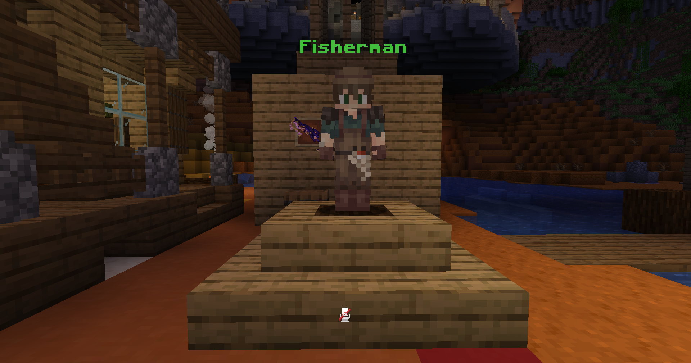

# Fishing

On this server, you can catch custom fish with any fishing rod! The fish rank from common to legendary, and each tier gives a set of rewards. Either by catching normal fish or custom fish, you can get vanilla XP and [Soul Affinity](../lore/soul-affinity.md) XP. As the fish quality goes up, so does the XP you earn. Legendary fish can even net you our custom gem item, which you can spend in the [Neotech Shop](economy.md#neotech-shop).

<figure><figcaption>
Legendary Fish
</figcaption></figure>

When you catch some good fish, make sure to sell them at the Fisherman NPC near the bridge at Spawn. Fishing is a good money-maker!

<figure><figcaption>
Fisherman NPC
</figcaption></figure>
