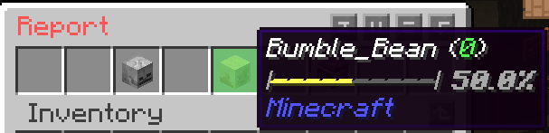

# Honor System

## Reporting

You can report players' deeds on the server by using `/report <player>`. You will see their honor level, expressed as an integer, as well as a percentage value. Every player starts at 0 honor, and if you report them for bad deeds, their honor goes into the negatives. If you report them for good deeds, their honor rises. There is a minimum honor level of -100 and a maximum of 100.

When you report players, you will be able to select the type of good or bad deed they did. Upon each report, the honor goes up or down 1 integer and half a percentage. You can see your honor level on the scoreboard. This is a way to build your reputation on the server. Will you be an outlaw, or a bounty hunter?


There is a 1 day cooldown between reports to prevent abuse. Using the reporting feature as a way to "witch hunt" other players is not allowed, and will have your permission to use the feature removed.


<figure><figcaption>
Reporting GUI
</figcaption></figure>

## Guilds

Coming soon!
