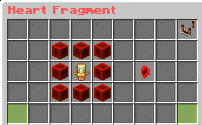
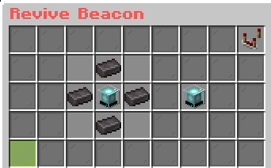

# Introduction

Lifesteal is a gamemode in which every time you die, you lose a heart. Like normal, you start with 10 hearts. However, if you manage to kill another player, you "steal" their lifeforce, taking their heart and adding it to yours. Thus, the name Lifesteal. The goal of this server is to become the most powerful player on the server. There are several ways to farm hearts, including standing near spawn and waiting for players to cross the PvP threshold. Once they cross that threshold, it's game on. Another way people farm hearts is with TPA request traps. Send a TPA request to a player and catch them off guard when they accept it.

When you die too many times and lose your final heart, you will be eliminated. The ban only lasts a day.

However, killing players is not the only way to farm hearts. You can also craft them, or earn them by looting structures, boss fights, buying a heart crate, and events. To craft heart fragments, use this recipe:

<figure><figcaption>
The heart fragment
</figcaption></figure>

By combining multiple heart fragments together along with other items, you can craft a full heart. However, it is very expensive:

<figure><figcaption>
The full heart item
</figcaption></figure>

Say your buddy dies on the server for the final time and loses his last heart. He would at that point be DEATH BANNED! Fret not, however. You can revive him with the mythical revive beacon:

<figure><figcaption>
The revive beacon
</figcaption></figure>

The revive beacon is insanely expensive of course, but it's always good to have in your back pocket. When you are revived, you will respawn with 5 hearts.
