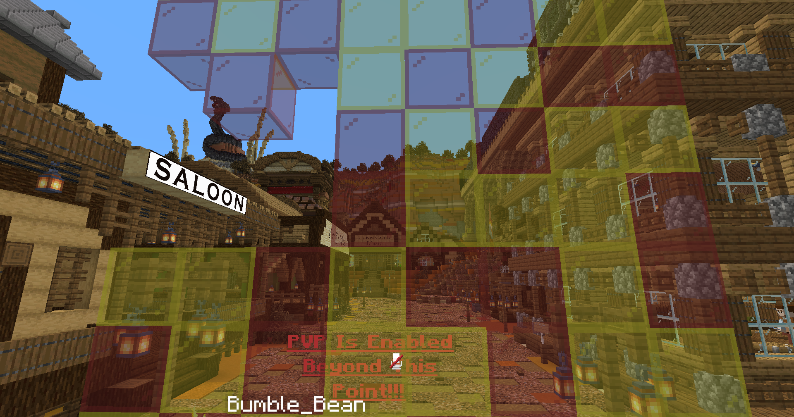
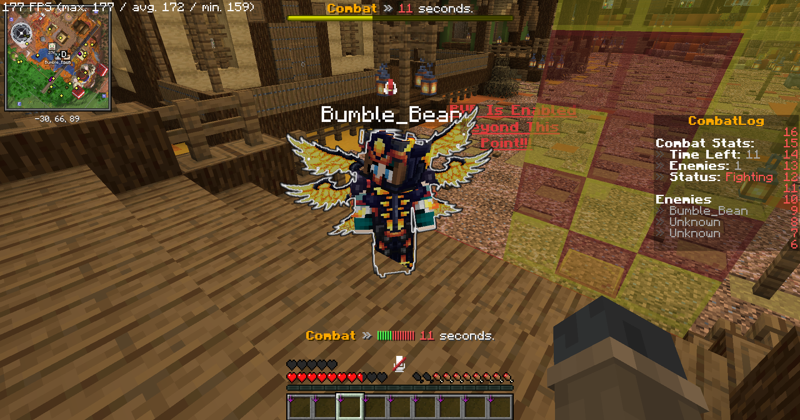
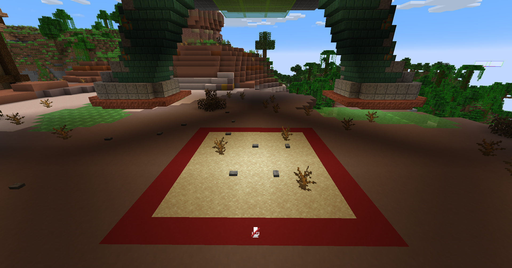

# PvP

## Safezone

There is a red square around spawn that separates the safezone from the rest of the hellscape that is Torrent Lifesteal. Cross the red concrete boundary at your own peril. You can run back and forth between the safezone and the PvP area with no issue, but if you enter combat you will not be able to return until combat has ended. You cannot return by walking, with commands, or any other way of attempting to run back to the safezone with your tail between your legs.

<figure><figcaption>
Safezone
</figcaption></figure>

## Combat Tag

When you enter combat, you will be combat tagged. The combat tag timer is 30 seconds. During that time, you will not be able to return to the safezone or use commands. If you logout while combat tagged, you will be sentenced to death instantly. You will notice your scoreboard change while combat tagged, with information about your attacker(s) as well as how long you are tagged for. This will also be displayed as a boss bar. This is also how long you will be unable to run commands or return to spawn.

<figure><figcaption>
Combat Tagging
</figcaption></figure>

## King of the Hill

Every two hours, King of the Hill will start near spawn. Take a left next to the auction house, then go inside the mountain and up the hill. King of the Hill is underneath the crashed UFO. The player in the red square for the longest is declared the winner. One needs to remain within the KoTH square until at least the last 15 seconds of KoTH to win.

Note: This isn't some kind of special mini-game where KeepInventory is on. You can still lose hearts and items. That's the risk you are taking.

<figure><figcaption>
King of the Hill
</figcaption></figure>

## Bounties

By using `/bounty`, it will open up a menu where you can view the current bounties, or set your own bounties on a player. You may want to set a bounty on a player who has wronged you in some way, or someone who is overly powerful and needs to be taken down a peg. The player who kills the player with a bounty on him will receive the bounty amount in full.

Bounties are viewable in the `/bounty` menu as well as on the bounty board in the Sheriff's Office. This board will automatically update when a new bounty is added, and they are ranked from left to right by order of the bounty amount.

## Other Metas

Many other PvP metas may become useful over time, or be discovered by the player base. These includes advanced [enchantments](enchanting.md), MMO [skills](skills/), [teaming](teams.md), TPA trapping, and many more. You can use any tools at your disposal to defeat other players. Finding custom items through questing may also prove fruitful. Get creative and discover the new Torrent Lifesteal meta yourself!


There are cooldowns for ender pearls, golden apples, and enchanted golden apples!

