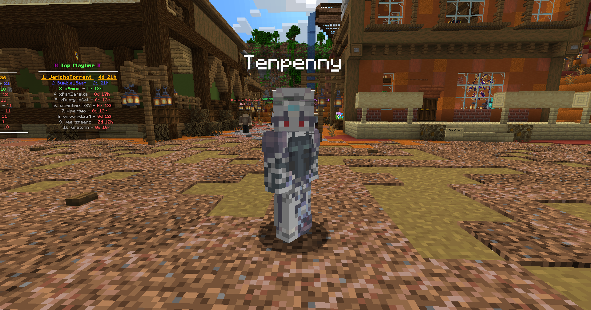
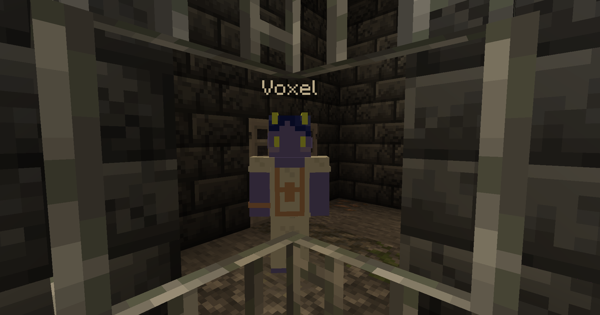
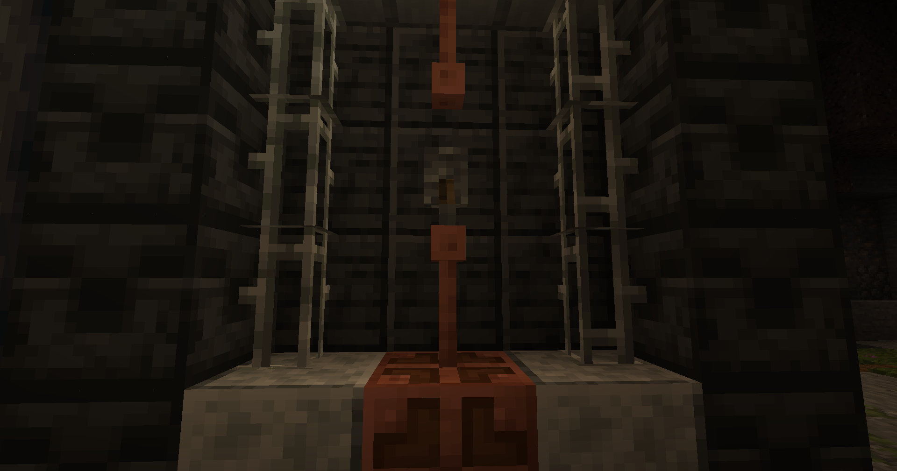

# Quests

So far, we have one major quest to start the server, with more coming in consistent content releases in the future.

## Cowboys Vs. Aliens

Right in front of you at spawn, you will meet the NPC Tenpenny. She is an Artorian alien stranded here on this planet after the Artorian spacecraft crash landed, disabling their engine from the components of Torrent's atmosphere.

<figure><figcaption>
NPC Tenpenny
</figcaption></figure>

Click on Tenpenny to start the quest. She will ask you for 64 redstone dust to begin repairs on the spacecraft's engine. Get it and return to her with it. She will then send you to find their chief engineer, Voxel. Voxel became trapped in the gem mine after accidentally triggering the power switch to an excavator, locking the emergency doors behind him.

You can find Voxel down the mine, to the left down a corridor, and up a set of wooden stairs.

<figure><figcaption>
NPC Voxel
</figcaption></figure>

Voxel will beg you to let him out. Hit the switch on the adjacent wall to turn off the excavators emergency locking mechanism.

<figure><figcaption>
Excavator Switch
</figcaption></figure>

Return to Tenpenny to claim your rewards. She will inform you that the outlaws have caused the aliens a lot of trouble, and ask you to kill three of them. The only outlaws you are aware of are other players, so get down with some PvP! After killing three players, return to Tenpenny to complete the quest Cowboys Vs. Aliens.
