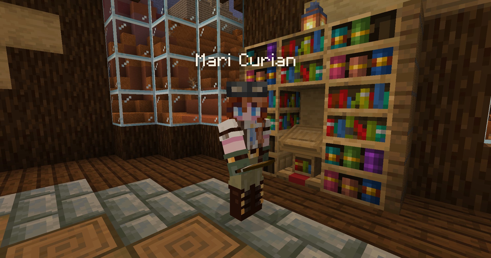

# Ancient Builders

Go inside the library at spawn, and you will find an archaeologist reading a book, Dr. Mari Curian.

<figure><figcaption>
Mari Curian
</figcaption></figure>

Mari Curian will tell you of her research into the Ancient Builders and the civilizations of the past. She will need you to collect samples from an Ancient City. Finding the City is on you, but there are several nearby spawn, such as at X: 191 | Y: -34 | Z: 928

Walk up to the portal frame in the center and click on any of the blocks to collect the samples.

<figure><figcaption>
Deepslate Portal
</figcaption></figure>

Return to Mari Curian. She will ask you to locate her compatriot, Dr. Chien-Shiung Wu in a trial chamber. She is located at X: -854 | Y: -26 | Z: 68. Click on her to complete the quest and start [The Trial](the-trial.md).
