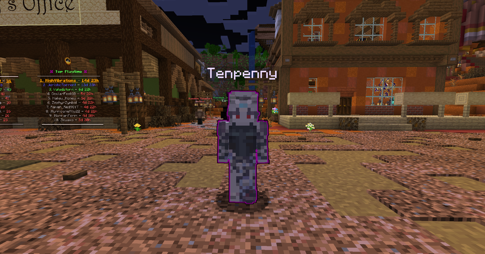
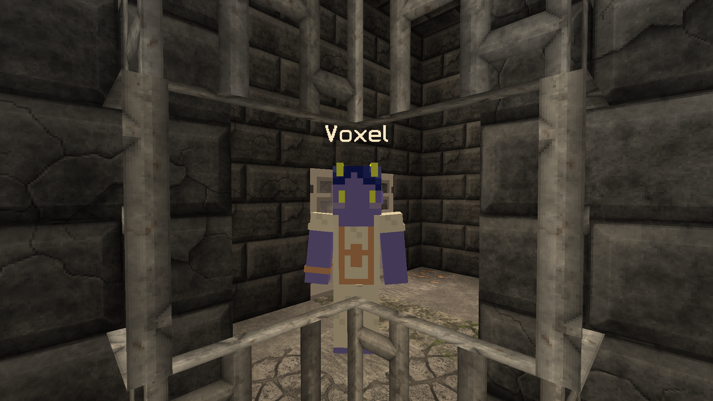
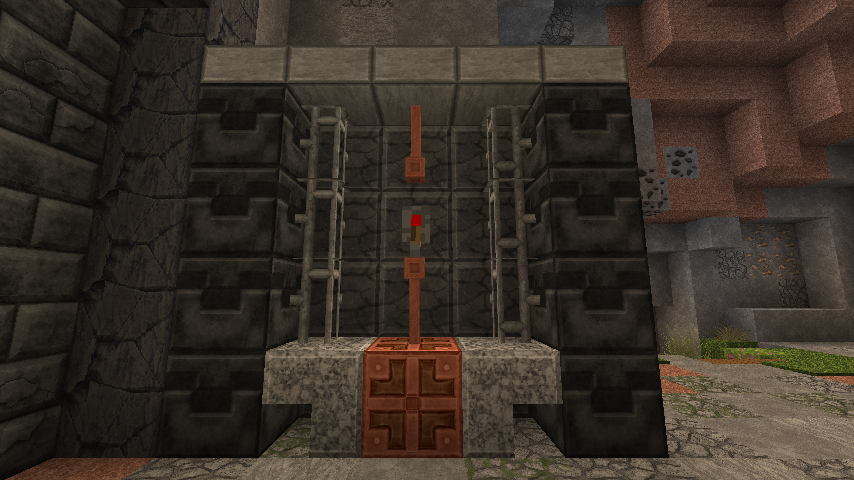

# Cowboys Vs. Aliens

<figure><figcaption>
Tenpenny
</figcaption></figure>

Tenpenny is directly in front of you, down the stairs from spawn. By clicking on her, you will initiate dialogue and start the quest. She will inform you that their spacecraft has crash landed on this planet, and their engine has malfunctioned. You will need to bring her 64 redstone to repair the engine. You can easily by this from `/shop` or mine for it.

Your next quest stage is to retrieve their Chief Engineer, Voxel, who was trapped in the gem mine. If you're looking at Tenpenny, turn directly right and go into the cave.


PvP is ON in the gem mine!


When you get to the bottom of the mine, turn right and go into a cave. This cave has a staircase to the left that leads to an excavation site.

<figure><figcaption>
Voxel
</figcaption></figure>

You can find Voxel at coordinates X: -10 | Y: 46 | Z: 182\
On the adjacent wall, you can flip the lever to free him.

<figure><figcaption>
Excavator Release Lever
</figcaption></figure>

Return to Tenpenny. Tenpenny will thank you for releasing Voxel and give you rewards. However, they still have unfinished business, and their craft is still missing components. First, she will inform you that the outlaws have been harassing her kind. She will ask you to kill three players to thin their numbers. Do so and return to Tenpenny to complete the quest.
