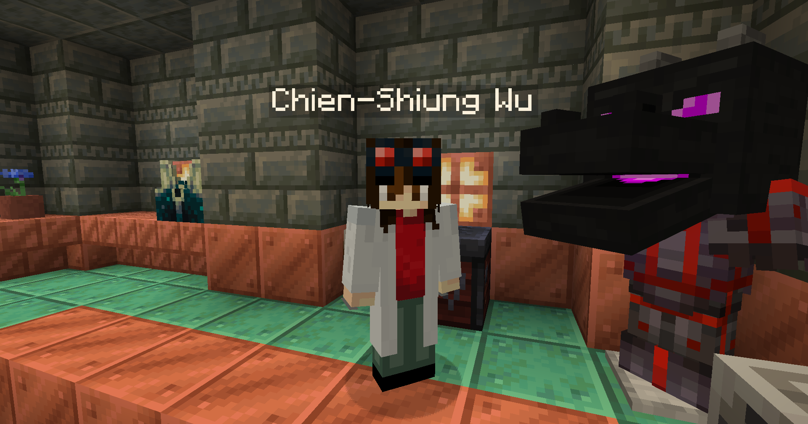
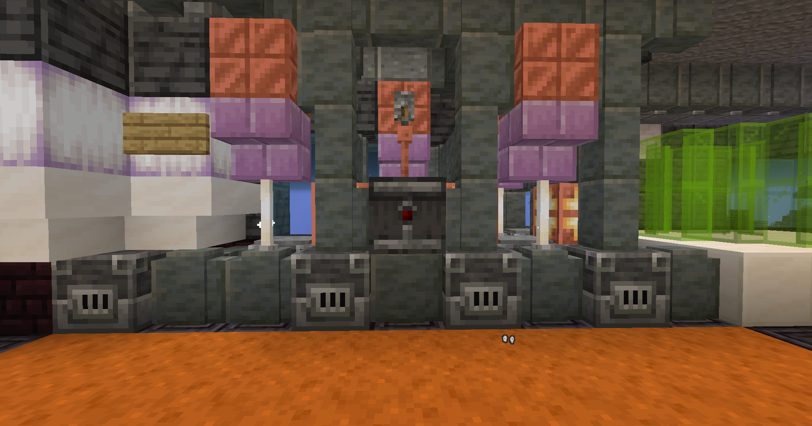

# The Trial

This quest is much more complex than any quests you have done so far. This is our first branching quests, meaning you have choices that affect the outcome at the end of the quest.

<figure><figcaption>
Dr. Chien-Shiung Wu
</figcaption></figure>

After meeting Dr. Wu, she will ramble about the Ancient Builders and ask you for an ominous key. You can find one by completing trials in the same chamber the research lab is in. Bring one back to her to complete this stage.

Next, this is where the quest diverges into branches. Dr. Wu will ask you for a heavy core, and explain that her goal is to sabotage the spacecraft's engine so the portal closes behind the aliens when the leave the planet. Optionally, you can also bring this heavy core to Tenpenny, and inform her about Dr. Wu's sabotage attempt.


This will raise your honor level by 25 points!


### Dr. Wu's Branch

If you bring the heavy core back to Dr. Wu, she will ask you to wait one day so she can reprogram the heavy core. Wait a day and return to complete this stage.

She will give you the heavy core back and ask you to install it in the spacecraft's engine. To get to the spacecraft, you can use an elytra or bridge over to it from outside the no-build area. Go inside the spacecraft by entering the exterior door on the deck. The engine is on the right side by the craft's main bridge.

<figure><figcaption>
Spacecraft Engine
</figcaption></figure>

Click on the observer with the heavy core in your hand. This will hack the engine to execute Dr. Wu's plan. Instantly, you will be teleported by the Ancient Builders.

The location you are teleported to is a latent asteroid in the End. Simply walk forward and touch the conduit to complete the stage. Then, you will be contacted by the Ancient Builders. I shall not spoil their dialogue. Listen to them speak to complete the quest.

### Tenpenny Branch

By returning to Tenpenny with the heavy core, you will inform her of Dr. Wu's sabotage attempt. Tenpenny will give you the heavy core back immediately, easily reprogramming the artifact with their advanced alien technology. You will then be tasked with returning to Dr. Wu and attempting to deceive her. By returning the heavy core to her, she will connect it to her machines, thereby installing malware.

Dr. Wu will become enraged, discovering your attempt to deceive her. She will summon her defenses: three wither skeletons of varying strength. Defeat the wither skeletons and return to Tenpenny. This completes the quest.


This will lower your honor level by 25 points!

