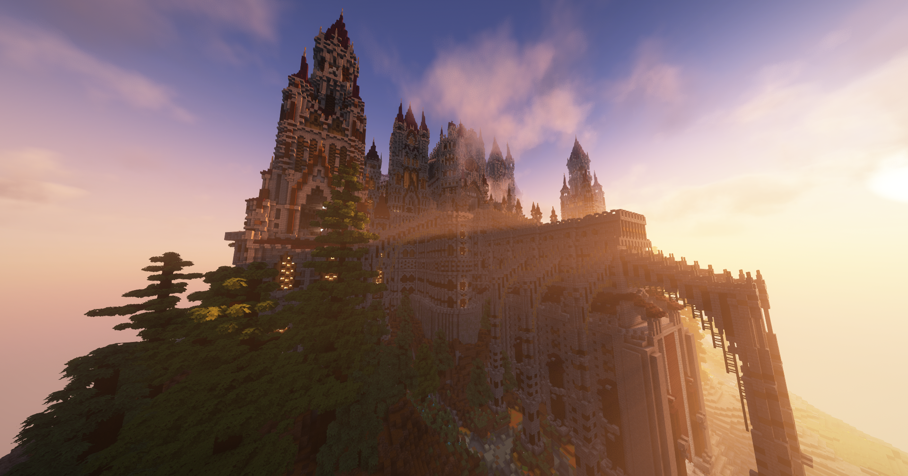

# Structures

The structures in the greater spawn region contain many things to uncover. Among them are loot chests that regenerate once daily. As you get deeper into the structure, you will find better and better loot chests. If a chest is already looted, just wait a while and it will regenerate. There are three tiers of loot: basic, advanced, and OP. You can also find lore books that will give the history and tell stories about the structure, the world before the alien invasion, and much more.

Also located in these structures are [bosses](../bosses.md). These three ranks of bosses are minions, mini-bosses, and main bosses. Making your way through the structures plays a lot like Dark Souls. You will find bosses of varying difficulty, getting tougher as your progress, leading to better and better loot. After you loot the structures, come back and try out your new gear in PvP, or spend your money and XP at spawn or with `/shop`.

Note: KeepInventory is **ON** only in these structures.

<figure><figcaption>
Lothric Castle
</figcaption></figure>

Lothric Castle is an epic labyrinthian structure modeled from Anor Londo in Dark Souls. The structure was originally built by an extremely talented builder, known as [LNeoX](https://www.planetminecraft.com/member/lneox/).&#x20;

<figure><figcaption>
Crystalled Castle
</figcaption></figure>

This structure, built by our beloved DeadlySento, is an epic monument to Torrent. With several boss fights including the Crystalled King, this place is a fortress of doom. This location is where you can obtain the Crystalled armor and tools set. Be careful! This castle is swarming with warriors and generals, as well as the mutated zombified king himself.

<figure><figcaption>
Torrent Cathedral
</figcaption></figure>

The Torrent Cathedral was built by Perovskite\_ and is also featured on SoftSlayer. It was posted on PlanetMinecraft and made its way onto Torrent Lifesteal to host an EPIC boss fight. There is one boss here, the alien conquistador known as [Traxis](../bosses.md#traxis).

<figure><figcaption>
Ancient Dungeon
</figcaption></figure>

This dungeon is the most ancient structure still left standing from the Race of Old. The ancient builders, who lived long ago, were once conquered by the Artorian Empire and most of the world was blown away or overgrown by alien fauna. This structure, however, is the last bastion of the ancient society left completely undiscovered by the Artorians. The dungeon is currently empty, ravaged by players.
