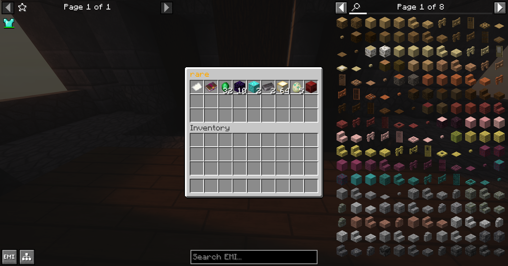

# Loot Chests

Getting loot from our structures is a great way to get XP, gear, and items that are hard to find. You can also find custom modeled legendaries and items. There are 6 tiers of loot chests: Common, Uncommon, Rare, Epic, Legendary, and Mythic.

<figure><figcaption>
Rare loot chest in Lothric Castle
</figcaption></figure>
