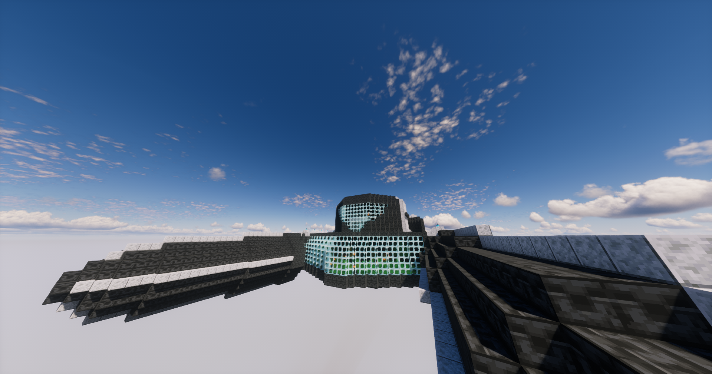
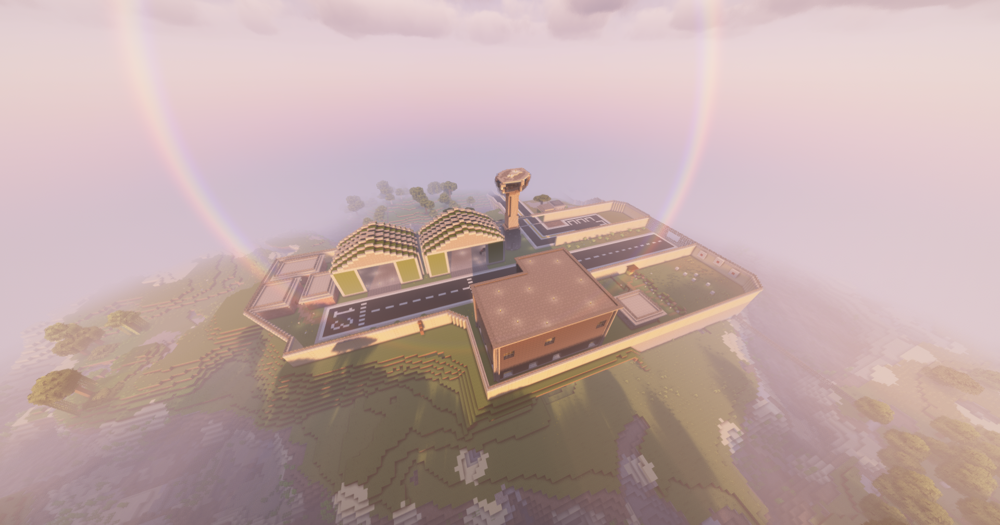

# Lore

## Backstory

14,000 years before the Modern Era, the Ancient Builders were the ruling class of Torrent. They experimented with a magic known as Soul Affinity, opening a portal to another realm called the Slate Dimension. This led to an apocalyptic event known as the [Convergence](the-convergence.md). This time period is when Torrent Lifesteal Season 1 takes place.\
\
A race known as the Artorians played a significant role in the apocalypse. They went through a civil war at the time, and Artorius Prime went back to the Slate Dimension to their home world of Artoria. For 14,000 years they conquered other realms. Their attention finally focused again on Torrent when they discovered vestiges of Soul Affinity arising once again. This led to the Alien Invasion event, an epic tale of Torrent. This event was supported by the [Movecraft](../movecraft.md) plugin, in which real air-based battles were possible on the server.

## Alien Invasion

On November 26th, 2023, the Artorians invaded Torrent in their epic [Dreadnought](../movecraft.md#dreadnought) craft. The Dreadnought is a large vessel capable of traveling great distances at a slow base speed, but is also capable of achieving warp speed with its highly advanced Alcubierre drive. During the invasion, the Torrent Military Base was a target, and the Torrent Global Defense Agency sprang into action to defend the base.

<figure><figcaption>
The fabled Dreadnought
</figcaption></figure>

<figure><figcaption>
Torrent Military Base
</figcaption></figure>

There were two teams, Torrent and Conquest. Conquest was split into two forces: the ground team and Artorius Prime's personal guard detail. The ground team geared up in a small outpost near the military base. While the TDA was preparing for the invasion, the Conquest ground team invaded the base and attacked. An epic team-based PvP battle took place, and Conquest was getting the better of Torrent while the TDA was attempting to take to the skies in their fighter jets.\
\
Finally, the TDA was able to kill enough invaders to gain just enough time for a fighter jet to take off. JerichoTorrent flew the jet, in an effort to board the now encroaching Dreadnought. Upon boarding the Dreadnought, Artorius Prime himself was there waiting. Artorius Prime slaughtered JerichoTorrent, but due to a bug with the Movecraft configuration, JerichoTorrent's [grave](../survival/graves.md) was enough to disable the craft. This gave the TDA the advantage. They all boarded the craft and the battle of attrition had begun. Artorius Prime was defeated and the TDA had won.\
\
Now, the Dreadnought hovers above the Shopping District, and anyone with the [Overlord+](https://torrent.tebex.io/package/6216890) rank is trained enough to pilot it. The Torrent Military Base stands as a testament to the indomitable human spirit. This event marks a majorly significant point in history when the human fighters overcame the alien invaders. However, some alien remnants remain somewhere in the world of Torrent. Find them and destroy the vestiges of their invasion by checking out our [Quests](../survival/quests/).
