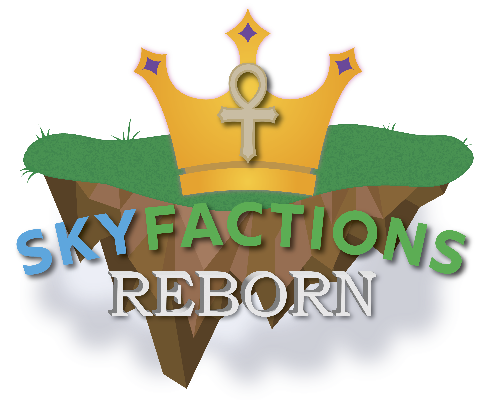

# Introduction

<figure><figcaption></figcaption></figure>

SkyFactions is a 100% original server implementation developed by [TerraByteDev](https://docs.terrabytedev.com), a development studio focusing on creating next-generation Minecraft plugins. The core plugin, [SkyFactionsReborn](https://docs.terrabytedev.com/skyfactions), had a long development cycle to ensure it would be a smooth gameplay experience upon release. The server will launch with a custom resource pack and will be packed with features beyond your imagination!

This gamemode is an elegant synthesis of the popular gamemodes Skyblock and Factions. Lovers of either of those gamemodes will find the features they know and love, seamlessly integrated together.

## Features

* Advanced raid mechanics for players and factions
* Custom unique currency called "gems"
* An island administration tool known as an "Obelisk"
* Tiered combat system similar to skill-based matchmaking
* Leaderboards, reward systems, and skyblock quest mechanics
* Much, much more!
