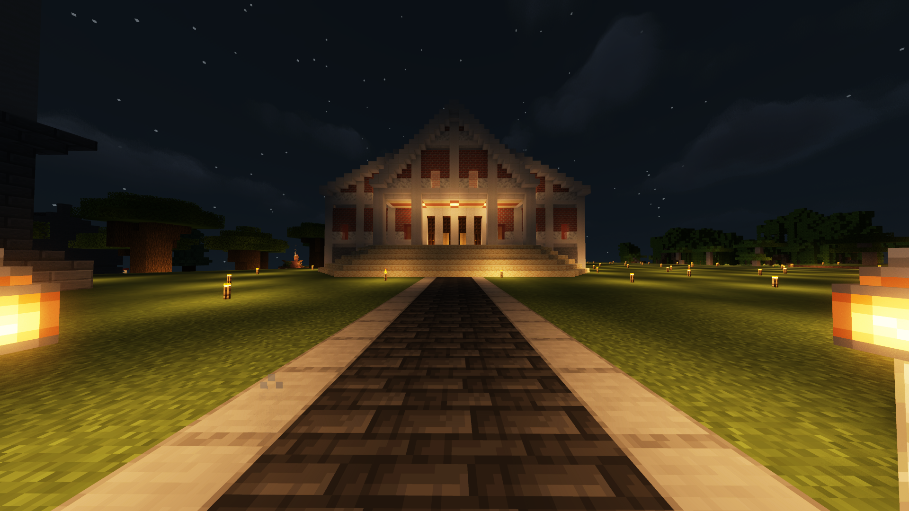
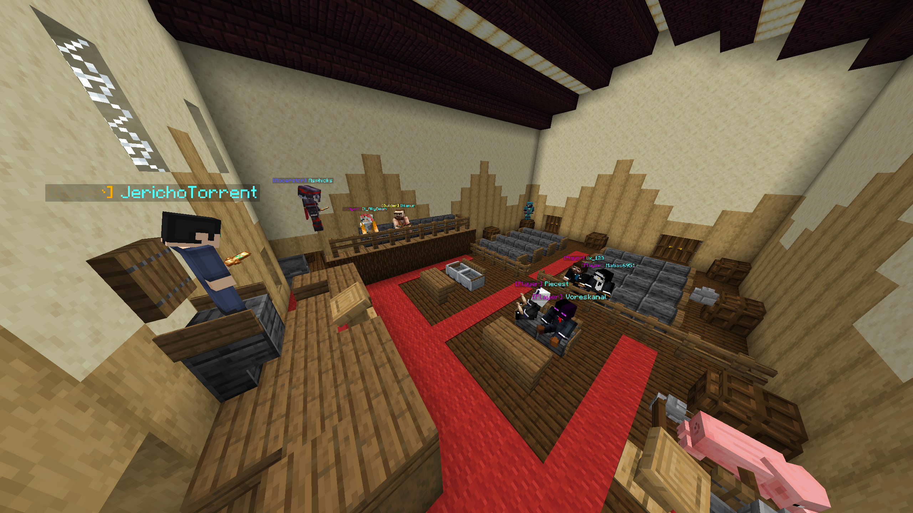

# District Court

## Initiating a Court Proceeding

The Torrent District Court is located on the Survival server in the Municipal District, right next to the Axél Village warp. There are many reasons why a court proceeding may take place, and criminal charges or civil liabilities can occur on any server. The primary reason for the Court is just for fun. Sometimes, a more engaging story can come from going to court instead of a moderator banning the offender.\
\
If a player commits some kind of crime or tortious interference, you can initiate a court proceeding by contacting a moderator. When that occurs, if the Torrent District Attorney feels that criminal charges are worth pursuing, a criminal court proceeding could take place. In that case, a judge will be chosen, and the case will start relatively soon after. If the case goes to trial, a trial date will be announced in Discord and a jury will be chosen.\
\
If a civil case is brought against a player, a judge will be chosen, and the case will proceed with just the two parties and any spectators that want to join. The judge will hear both sides' arguments and be impartial in the case.

<figure><figcaption>
Torrent District Court
</figcaption></figure>

## Reasons for Court Proceedings

#### Civil Cases:

A player accused a moderator of killing him for no reason on Survival, where PvP requires consent. The case went to trial and the plaintiff won the case. The moderator was forced to pay the player in money and in-game items, and was placed on probation. If the moderator were to reoffend, he would lose his mod status (which he eventually did.)

#### Criminal Cases:

1. A player was accused of hacking when the anti-cheat was temporarily removed for maintenance. The player argued his case, provided screenshots, and other evidence of his innocence. The correspondence between him and his friend was in Danish, so the prosecution had a translator to make testimony on record. The defendant won the case, and was acquitted of all charges.
2. A player joined the network and was accused by an anonymous witness that he and his friend conspired in VC to grief and destroy the server, by gaining the trust of the administrators. Three separate trial dates occurred, and a ton of shenanigans took place. Ultimately, the prosecution felt there was not enough evidence to continue and dropped the charges.

<figure><figcaption>
Court Proceeding taking place, featuring Michael the Divine Pig of Justice (bottom right)
</figcaption></figure>
