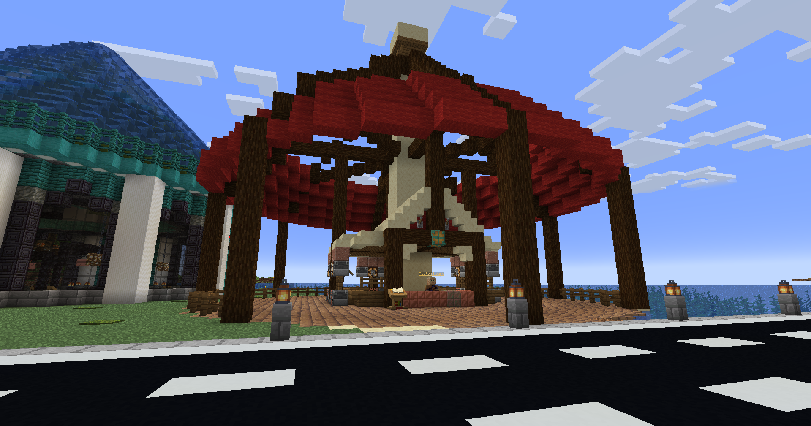

# Economy

The economy is, perhaps, the most complex system on the server, so I would recommend reading this guide in full. We will begin by discussing a few ways to make money, how trading and selling items is facilitated, and what you can do with that money.

## **How to Make Money**

You can use `/sellgui` and drag and drop items from your inventory into the menu. Upon closing it or clicking the nether star, any eligible items will be sold, and any ineligible items will be returned to your inventory. You can also earn money by [voting](../voting.md). Each vote is worth $500, and you can also trade voting points for money using `/voteshop`.\
\
Another great way to make money is by completing quests. These quests usually have monetary or sometimes, have specific item rewards without straying too far from the vanilla meta. For example, the quest Travelin' Torrent has a reward of $5,000. To really earn some cash, check out the Clockwork Questline.\
\
Another thing a lot of players do is offer their services to others. Players make posts in #looking-for about items or services they need. You can claim these bounties by talking in a thread and fulfilling your end of the bargain. People will also offer or make requests in chat to see who is available to make a trade. A great place to meet and trade is at Spawn or the Nether Hub. Finally, you can create a shop, which requires approval from staff.

## How to Make a Shop

In order to create a shop in the shopping district, you need to get approved by the moderators first. Come up with a business plan and use #create-a-ticket once you're ready to pitch your idea to the mods. It is best to show some sort of mockup of your shop to ensure it will fit within the theme of the shopping district, modern/fantasy. You can create a mockup by:\
1\. Drawing a draft of the shop on paper\
2\. Building it first on the creative server and sharing screenshots, or having a mod join the server to view the shop\
3\. Building it on your own single player world and sending screenshots\
4\. Describing the style of your build in a way that gives us an accurate depiction of what it will look like\
\
Once the shop has been approved, a staff member can give you a plot in the shopping district. It is then your responsibility to take it from there. Remember, you can control permissions of the shop and do not have to use our virtual economy. Meaning, you can use `/containertrust all` to use trades such as diamonds in your shop. However, dealing with loss prevention is your responsbility. If you wish to use our virtual economy, you have a few options:\
1\. Place chests in your shop that you will sell items out of. Look at the chest while holding an item you want to sell in your hand and type `/createshop <buyprice> <sellprice>`. For example, if you want to sell oak logs at $10 a piece and do not want to buy them back from players, hold an oak log in your hand and look at a chest, then type `/createshop 10 0`.\
2\. Buy a shopkeeper egg from the Plot Shop at 60 Main Street. You can then place the shopkeeper within your shop and click on him, editing the shop to your liking and placing the items you want to sell in the GUI menu. Follow the on-screen instructions and you're done.\
3\. Sell vouchers for services you wish to provide. If someone buys your voucher you will provide the service. A few players on the server have been doing this.\
\
You can also build a shop at your own base without having to worry about approval. Just don't spam chests with holograms everywhere as it will lag the server and at the very least lag the client when people visit you.

## **Where to Spend Money**

The primary place to spend your money is the shopping district. It's located around x:0 / z:0. To buy something in a shop, click on the chest and it will pull up a GUI. Select the button to either buy 1 item or a stack of items. Some shops allow you to sell items back to them, especially the Stone and Ore shop which has flash sales often. This will usually net you a lot more money than the SellGUI will. \
\
If you want something specific, or need a service rendered, make a post in #bounties and see if anyone takes you up on it. You should post your request, a description of what you need, and the payment for completion of the request. To pay someone directly, use `/pay <player>`. This is a great way to get involved with the community. Some players make a name for themselves doing services for others and even start businesses using their specific niche, like Kiokugames, the redstone engineer.

## Auction House

On Survival, Auction House is a physical location. It is located at 44/63/33 in the Shopping District. You can sell an item from anywhere by holding it in your hand and typing `/ah sell <sell price>`. For example, I want to sell a sword, so I hold the sword in my hand and type `/ah sell 1000` to list the sword on the AH for $1,000. Players can visit the physical auction house and buy the sword.

To cancel a listing, visit the AH and go to your profile (your head icon.) Click on "Listings" and click on the listing to remove it. Don't worry, it isn't gone for good. It will show up under "Expired Listings." Click on it to redeem the item.

<figure><figcaption>
Auction House
</figcaption></figure>
