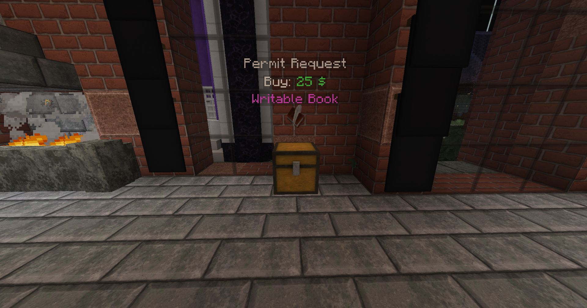
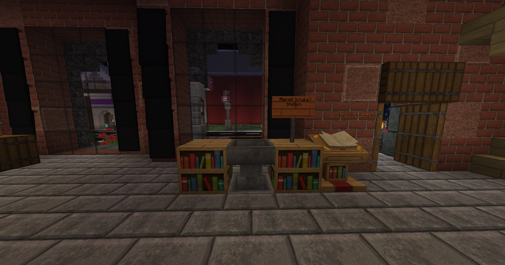

# Economy

The economy is, perhaps, the most complex system on the server, so I would recommend reading this guide in full. We will begin by discussing a few ways to make money, how trading and selling items is facilitated, and what you can do with that money.

## **How to Make Money**

You can use `/sellgui` and drag and drop items from your inventory into the menu. Upon closing it or clicking the nether star, any eligible items will be sold, and any ineligible items will be returned to your inventory. You can also earn money by [voting](../voting.md). Each vote is worth $500, and you can also trade voting points for money using `/voteshop`.\
\
Another thing a lot of players do is offer their services to others. Players make posts in #looking-for about items or services they need. You can claim these bounties by talking in a thread and fulfilling your end of the bargain. People will also offer or make requests in chat to see who is available to make a trade. A great place to meet and trade is at Spawn or the Nether Hub. Finally, you can create a shop, which requires approval from staff.

## How to Make a Shop

In order to create a shop in the shopping district, you need to apply for a permit first. You can find the permit office in the Shopping District just to the left of the main warp, at 25 Main Street. The process of applying for a permit looks like this:

1. Purchase a book & quill from the shop inside the Permit Office, or alternatively bring a book & quill from your base.

<figure><figcaption>
Permit Request Shop
</figcaption></figure>

2. Write up your permit request including:

* The architecture of the shop you intend to build, for example: A modern building made of white concrete and andesite, 3 stories, with a flat stone roof.
* The items you want to sell in your shop. Please limit it to like-items; meaning, items that are similar to each other in nature or theme.
* Where you intend to build the shop; in the Shopping District, or somewhere else in the world.

3. Place the permit request in the hopper in the Permit Intake Station. Wait for an in-game mail from a Permit Office Board Member.

<figure><figcaption>
Permit Intake Station
</figcaption></figure>

## **Where to Spend Money**

The primary place to spend your money is the shopping district. It's located around x:0 / z:0. To buy something in a shop, click on the chest and it will pull up a GUI. Select the button to either buy 1 item or a stack of items. Some shops allow you to sell items back to them, especially the Stone and Ore shop which has flash sales often. This will usually net you a lot more money than the SellGUI will. \
\
If you want something specific, or need a service rendered, make a post in #bounties and see if anyone takes you up on it. You should post your request, a description of what you need, and the payment for completion of the request. To pay someone directly, use `/pay <player>`. This is a great way to get involved with the community. Some players make a name for themselves doing services for others and even start businesses using their specific niche, like Kiokugames or Kishku7, the redstone engineers.

## Auction House

On Survival, Auction House is a physical location. It is located at 44/63/33 in the Shopping District. You can sell an item from anywhere by holding it in your hand and typing `/ah sell <sell price>`. For example, I want to sell a sword, so I hold the sword in my hand and type `/ah sell 1000` to list the sword on the AH for $1,000. Players can visit the physical auction house and buy the sword.

To cancel a listing, visit the AH and go to your profile (your head icon.) Click on "Listings" and click on the listing to remove it. Don't worry, it isn't gone for good. It will show up under "Expired Listings." Click on it to redeem the item.

<figure><figcaption>
Auction House
</figcaption></figure>
