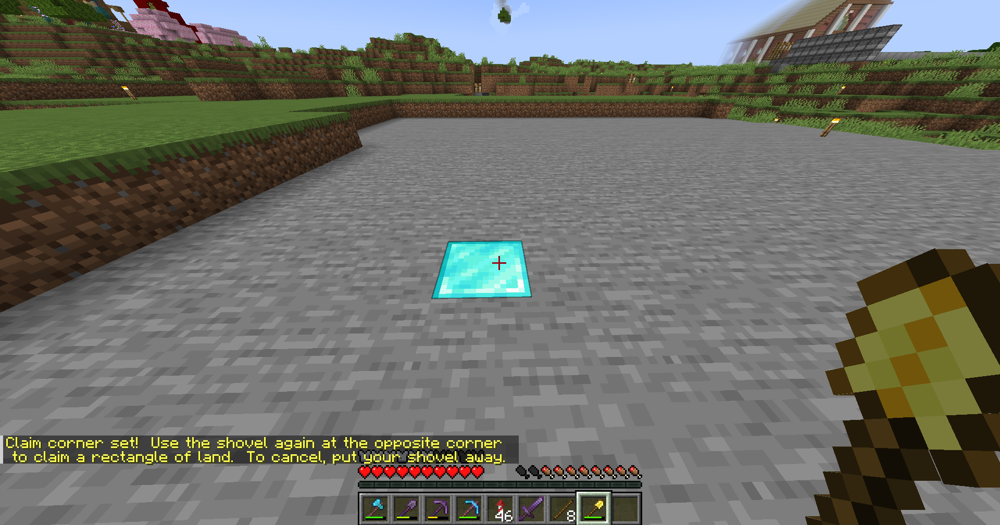
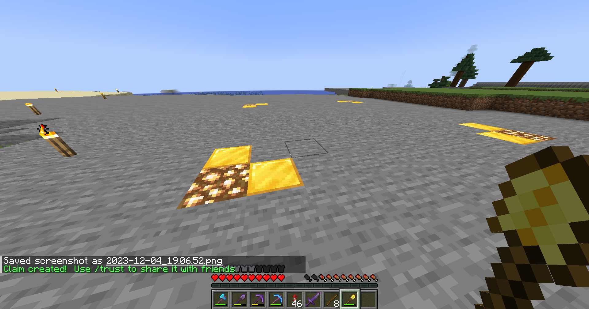

# Land Claims

Claiming land on the server is quite simple. Find a good place to get set up (read the rules on where you can build) and take out a golden shovel. With the shovel in your hand, right click two opposite corners of your intended claim. Congrats, your claim is now IMPOSSIBLE to grief!&#x20;

## How to Claim Land

<figure><figcaption>
First corner
</figcaption></figure>

<figure><figcaption>
Second corner; claim is created
</figcaption></figure>

If you wish to authorize access to your claim to other users, stand inside your claim and use one of the following commands:

<table><thead><tr><th width="200">Command</th><th>Description</th></tr></thead><tbody><tr><td>/permissiontrust</td><td>The highest tier; this gives a player full access to handle permissions in your claim</td></tr><tr><td>/trust</td><td>Allow a player to place and break blocks, access containers, beds, and redstone devices</td></tr><tr><td>/containertrust</td><td>Allow a player to access containers, beds, levers, and buttons</td></tr><tr><td>/accesstrust</td><td>Allow a player to access only beds, levers, and buttons</td></tr></tbody></table>

Remember to include the argument of the player's name after running the command. You can also subdivide your claim using `/subdivideclaim` and making a new claim within the claim. You can use the same commands above to give separate permissions for the subdivision. If you need to buy more claim blocks, you can use `/buyclaimblocks <value>`. However, you do accrue claim blocks over time. For the full list of commands, use `/commands`.
