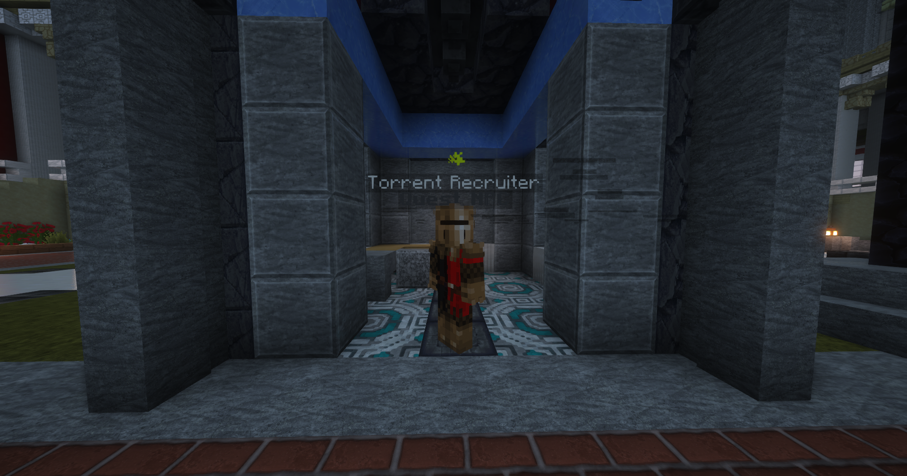
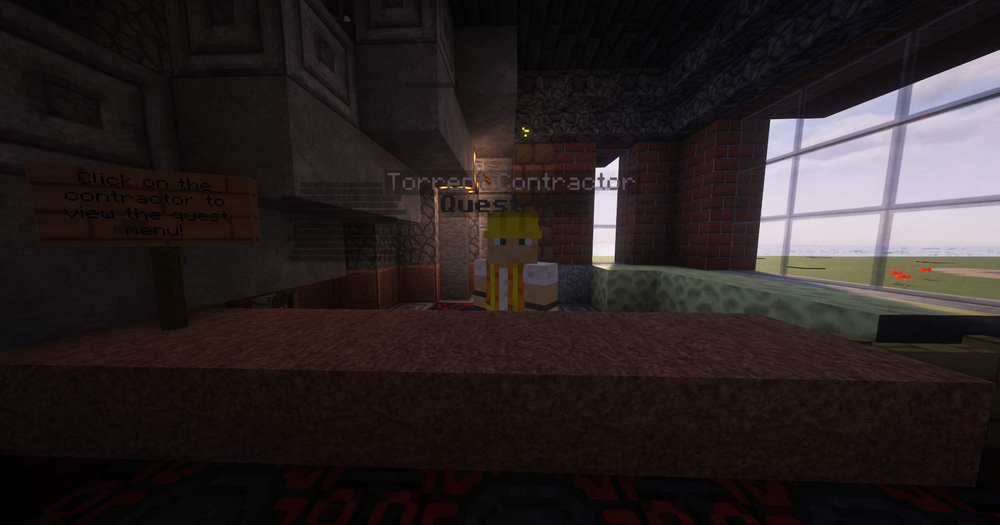
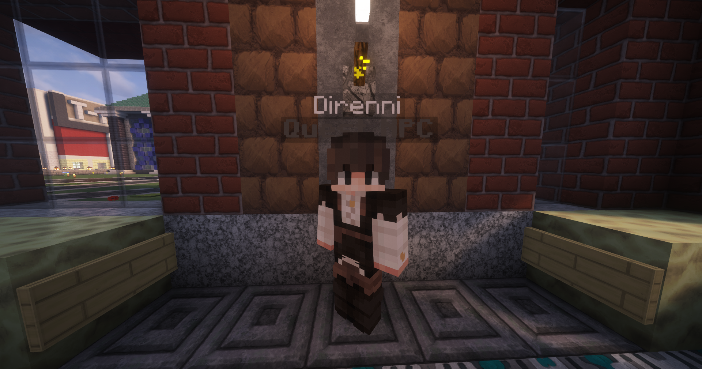

# Quests

## Prologue

To get involved with the RPG mechanics on Torrent SMP, you have two options:\
1\. Type `/quests` and view the quest menu. Certain quests you can start from here and even read the dialogue. Some quests cannot be started from the menu, including the main questline.\
2\. First you will want to talk to the Torrent Recruiter in the shack just behind you when you spawn into the SMP. From there, head to the Quest Emporium at x:75 / z:-30 and go inside. There, you will find the Torrent Contractor, who can give you your first quest "Travelin' Torrent." This quest is a great introduction and a tour of sorts across the server. After finishing this quest, go into the back room to start the main quest.

<figure><figcaption>
Torrent Recruiter, just behind the Spawn Rotunda
</figcaption></figure>

<figure><figcaption>
Torrent Contractor, in the Quest Emporium in the Shopping District
</figcaption></figure>

## Main Questline

The Torrent SMP Main Questline consists of two interconnected stories that eventually link together in an epic synthesis of events- driven by your gameplay. You can play both questlines concurrently, but at a certain point in either questline you will reach a point where there is unfinished business in another quest, and you will be directed to start the other questline before continuing. The first thing you should do after completing the Prologue, is go to the Quest Emporium (location of the Torrent Contractor) and go in the back room. Speak with the NPC Direnni and you will be given your first Main Quest.

<figure><figcaption>
Direnni
</figcaption></figure>
