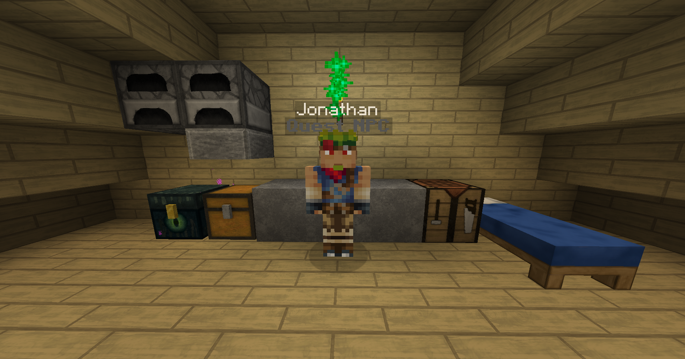

# An Off Request

Your first quest is quite simple. Travel to X -1364 Z 1073 in the overworld. There you will find the NPC Jonathan, who distrusts you at first due to your unknown origins. He explains that they have been gathering information about hostiles. To complete this quest, simply click on him to talk, then click on him again to start his own quest.

<figure><figcaption>
Jonathan
</figcaption></figure>
