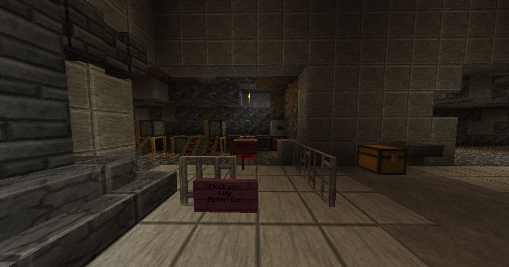
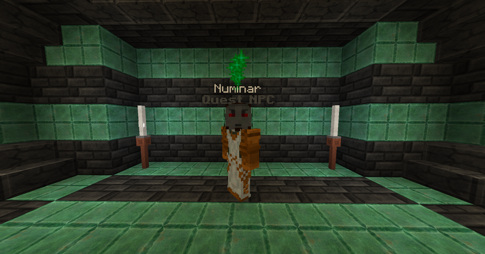

# Far From Home

It's time to get your bearings in Clockwork City. This place is dangerous and difficult. There are many factotums patrolling and protecting the area from intruders. You may need to gear up and come back later if you're under-geared. Take note of the location if you choose to do so. If you choose to ignore the warning, continue forward.

You are searching for Numinar, a resident of Clockwork City. He can be found straight back from where you teleported into the city. Eventually, you'll come across a piston bolt network. Take the piston bolt to the left. Here presents another Shopping Cart Theory situation. Do you put the minecart back in the chest when you get to the end?

<figure><figcaption>
Piston Bolt Network
</figcaption></figure>

Go straight from the piston bolt network exit and continue into the town square. Be careful not to enter the Teleportation Array, but if you do, simply take the return portal to Clockwork City on the second floor of the [Teleportation Hub](broken-reference).&#x20;

In the rear oxidized copper building straight back and on the second floor, you will find Numinar. Talk to him to complete the quest.

<figure><figcaption>
Numinar
</figcaption></figure>

Talk to Numinar again to start the quest "Greasing the Gears."
