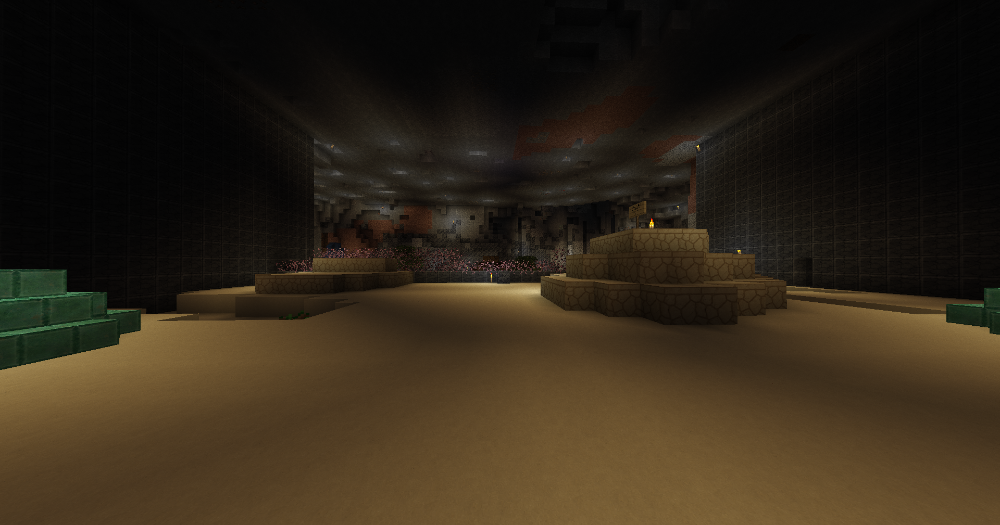
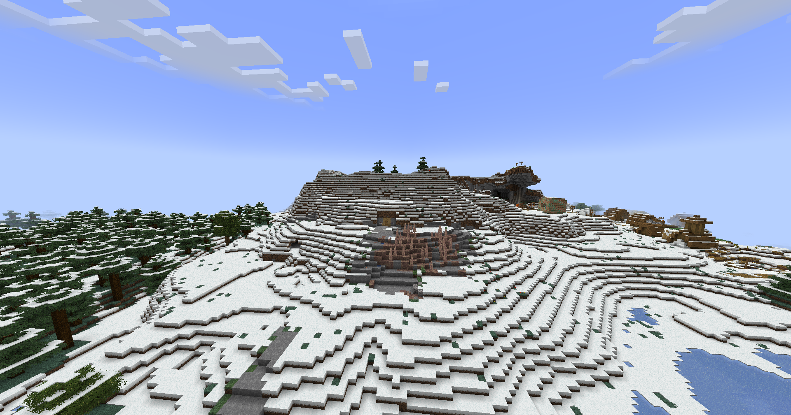

# Into the Dark

Jonathan will send you to the ruins of the Old Clockwork City to collect an essential power source: blaze rods. The location to enter the ruins is directly West from Outpost C. The coordinates to the entrance are `-1442 / 87 / 989`. Once you enter the subsection, head deeper into the city and avoid going into caves; stay in the main structure. You will eventually reach a wide open cavern with a sand floor. Head through the ruined piston doors and take a right. This will lead to a broken down elevator shaft. Jump down into the water below.

<figure><figcaption>
The elevator shaft to Clockwork Mining and Production.
</figcaption></figure>

Head into Clockwork Mining and Production and you will eventually come across a copper labyrinthian structure. Inside you will find a blaze spawner where you can farm them. Get 5 blaze rods and head back up to Outpost C.

<figure><figcaption>
Head inside this room to farm blazes.
</figcaption></figure>

After completing the task, head back up and talk to Jonathan. He will thank you for your service and send you yet again back into the mines. You were yearning to go back there anyway; don't complain. This time, you're searching for an altar with important knowledge. To find it, head back toward the large underground biome in Old Clockwork City. Head into the cavern and take a left, past the buildings and into the overgrown cave.

<figure><figcaption>
Head past the cherry leaves and straight back.
</figcaption></figure>

At the altar, you will find a book: Tinkerer's Scrap #47. After finding the book, you can read it, but don't bother trying to pick it up. Simply finding it is enough.

<figure><figcaption>
The altar
</figcaption></figure>

After gaining the knowledge, head back to Jonathan to debrief him of your findings.

The final mission for this quest is to find Terra Nova, an eccentric character with vast knowledge of ancient history, magic, and Clockwork City itself. His coordinates are `-2035 / 79 / 1562`. Find him, and continue moving forward.

<figure><figcaption>
Ezo Peaks
</figcaption></figure>

Head into Ezo Peaks, into the hobbit hole and you will find Terra Nova. Speak with him and complete the quest. Click on him once more to begin the quest "Hermit's Request."

<figure><figcaption>
Terra Nova, a kooky old geezer.
</figcaption></figure>
