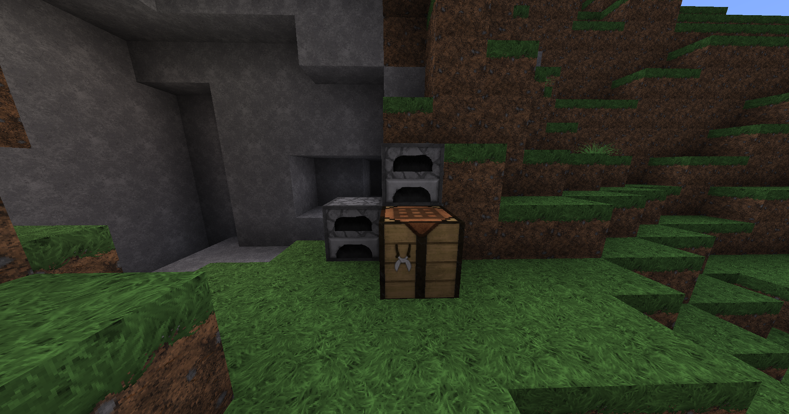

# Into the Field

After talking to the Outpost C team, you will be sent to go gather charcoal to power their local mining operation. You can easily complete this quest by hacking down some trees and using one of the nearby furnaces to smelt 10 logs into charcoal. Keep this charcoal in your inventory when you go back to talk to Tom.

<figure><figcaption>
Go out from the Outpost shack and turn left to find some furnaces.
</figcaption></figure>

Your next task is to collect 25 oak logs. This will present you with a moral conundrum. Do you replant the trees for the next player to come along to do the quest, or do you just let the saplings despawn? This is very reminiscent of the [shopping cart theory](https://www.keithsobus.com/blog/shoppingcarttheory).

Once you gather the oak logs, return to Tom to complete the task. He will comment on how useful this will be to the mining operation. He will redirect you to Jonathan who will want to talk to you about your next task. Notice how they keep calling each other the boss? Nobody wants to take the responsibility for this operation.
