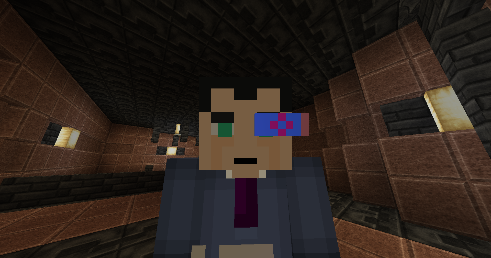

# Invasion

Head out into the Radius and head West. You will come across a grassy area to the South. Head underneath the archways into the Garden. That is where you will come across the alien invader. This is a hard-fought battle, so make sure you are properly geared up. Once you defeat the alien, head back to the Upgate Station in the Radius.

After talking to Alice again, you will get an epic reward: the Chronographer Visor. This piece of technology can be worn like a helmet and will let you look directly at endermen without drawing their hostility, without losing visibility at all.

<figure><figcaption>
Chronographer Visor
</figcaption></figure>

Alice will tell you to go the library to gather text or talk to a factotum. Head back to the town square from the Radius. Go North from the intersection with the teleportation array. Then, go inside the Library. You need to talk to the Librarian, whose location is `17114 / -3 / 4712`. The Librarian will play a log for you about the World Shaping Device.

Return to Alice with the information you have learned. Alice will urge you to go back into the Upgate and it will teleport you to the under construction. Upon teleportation, you will complete the quest. Talk to the CCS in the under construction to start the quest "Answers."
