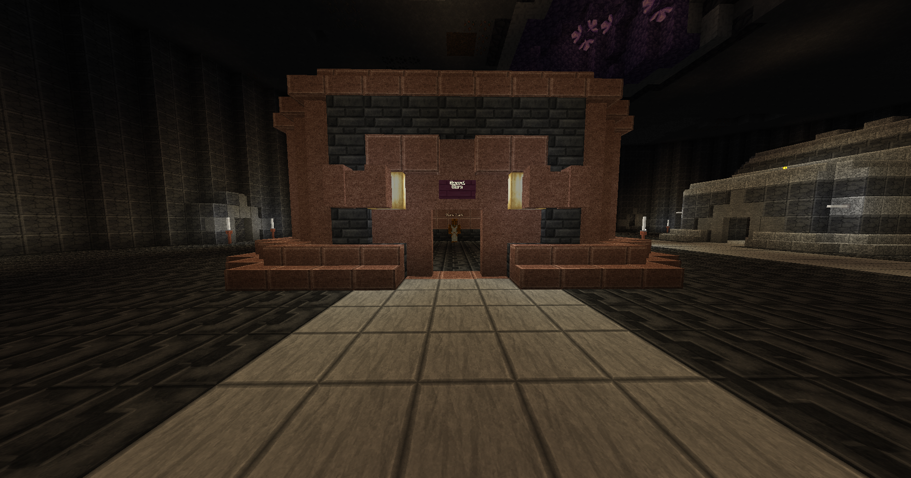
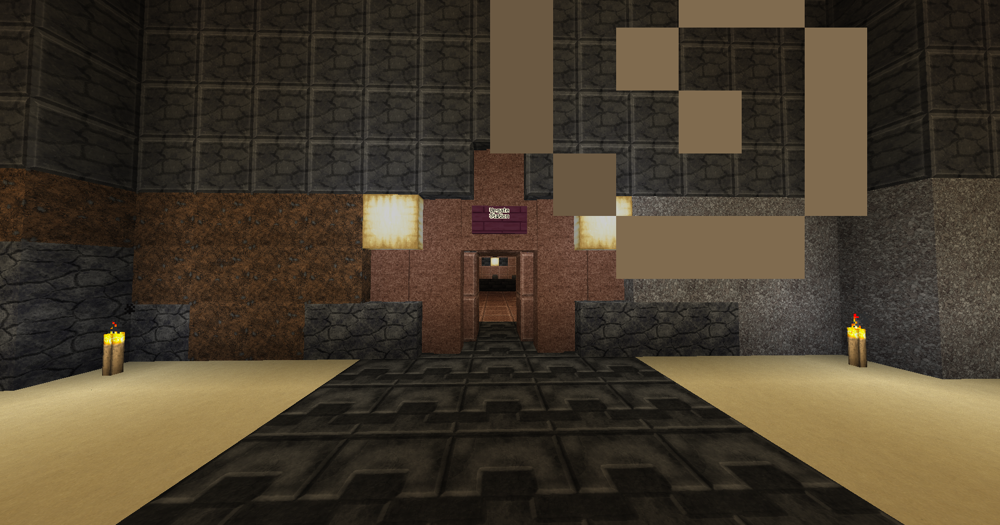
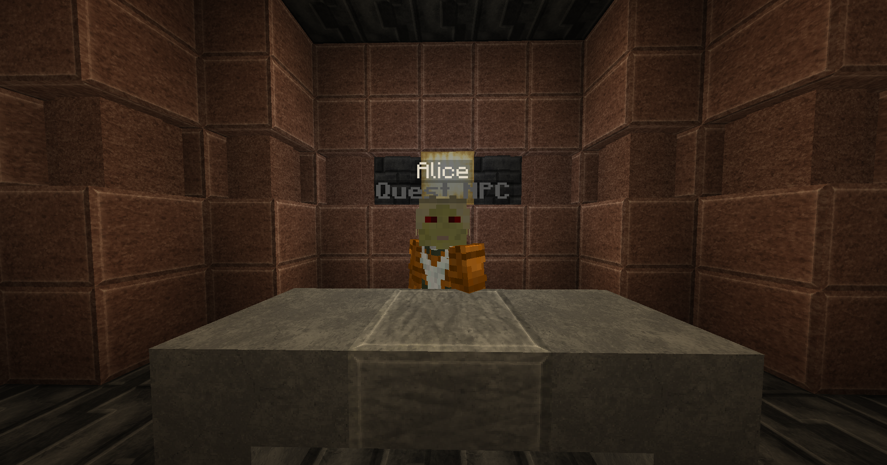

# Sent From Above

While talking to Thrash you will come to realize he is not really a drunk, and knows a lot more than he's letting on. He will send you to go buy some blaze rods from the Store Clerk. Don't worry, you can put it on his tab. Turn right out from the tavern and go back up the stairs. Head straight past the teleportation array and go into the building on your right, the General Store. The Store Clerk will sell you the blaze rods and you'll be on your merry way.

<figure><figcaption>
General Store
</figcaption></figure>

Go back to Thrash and he will give you a real mission. It turns out he's an experienced contractor and has been hiding his skills behind the bottle. He sends you to go speak with Alice, who runs the Upgate Station in the Radius of Clockwork City. This location is the main forum near where you teleported into the city. Head back up the stairs and take a right. Continue going straight until you get to the piston bolt and take the return network.

Go straight from the piston bolt to the very end of the open section and go into the last room on the right. There you will find the Upgate Station.

<figure><figcaption>
Upgate Station
</figcaption></figure>

Go inside and take a left to meet Alice. Her exact coordinates are `17434 / -3 / 4574`. Talk to her to complete the quest. Talk to her again to start the quest "What's Up Gate?"

<figure><figcaption>
Alice
</figcaption></figure>
