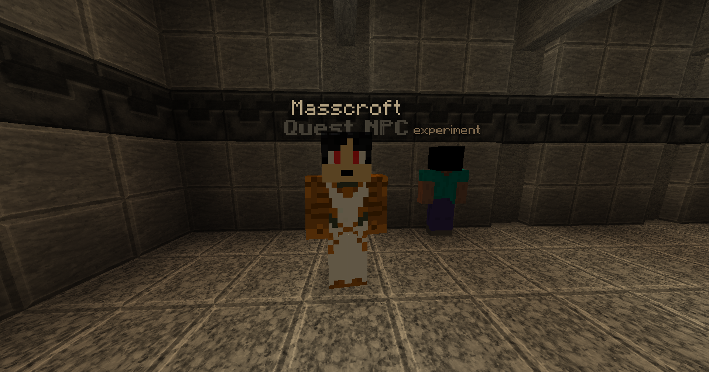

# What's Up Gate?

After talking with Alice, go to the next room and go around the deepslate wall into the teleporter. Step inside and let it do the rest. Simply using the teleporter will complete the quest. To continue the story, go out from the first room and take a left. Go inside the Redstone Labs. There you will find Masscroft and his experiment. His exact coordinates are `-1324 / -50 / 1089`. Speak with him to start the next quest, "Into the Deep."

<figure><figcaption>
Masscroft
</figcaption></figure>
