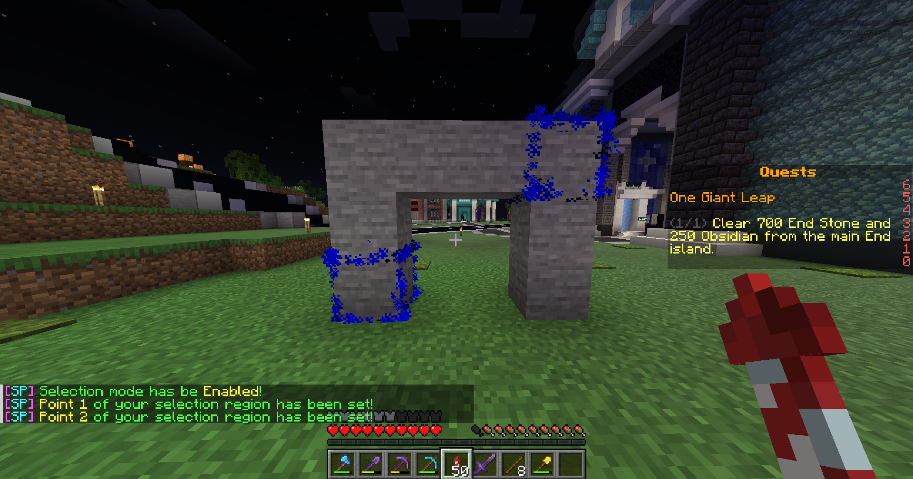
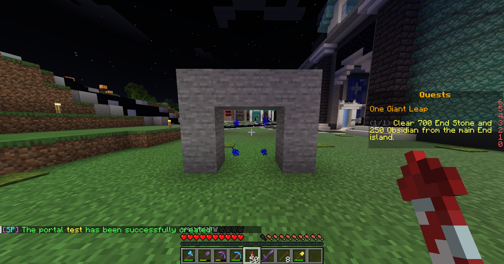

# Access Points

While you can always make a portal on the nether roof for quick and easy travel back to our districs, the Access Point system is another option. An Access Point is a teleporter that instantly links back up to the hub. In order to set one up, follow these steps:\
\
1\. Build a portal of any shape or size out of any materials you want.\
2\. Type `/sm`, left click one corner, then right click an opposite corner. I usually do bottom left then top right or vice versa. Your selection should be complete.

<figure><figcaption>
<code>/sm</code>
</figcaption></figure>

3\. Type `/accesspoint <name>` and you're finished. For example, if I want to make a portal named with my player name (which I recommend) I would type `/accesspoint JerichoTorrent`

<figure><figcaption>
<code>/accesspoint &#x3C;name></code>
</figcaption></figure>

After completing the above steps, you should now have a portal leading back to the Teleportation Hub. If you set your spawn in a bed, you can use your portal to get to the Hub and use the bed portal to get back to your base. Do keep in mind this is a one time action, as you won't be able to make more than one. If you mess up or need to move your portal, use #create-a-ticket in discord and write what went wrong, the name of your portal, and how you would like the situation ameliorated.
