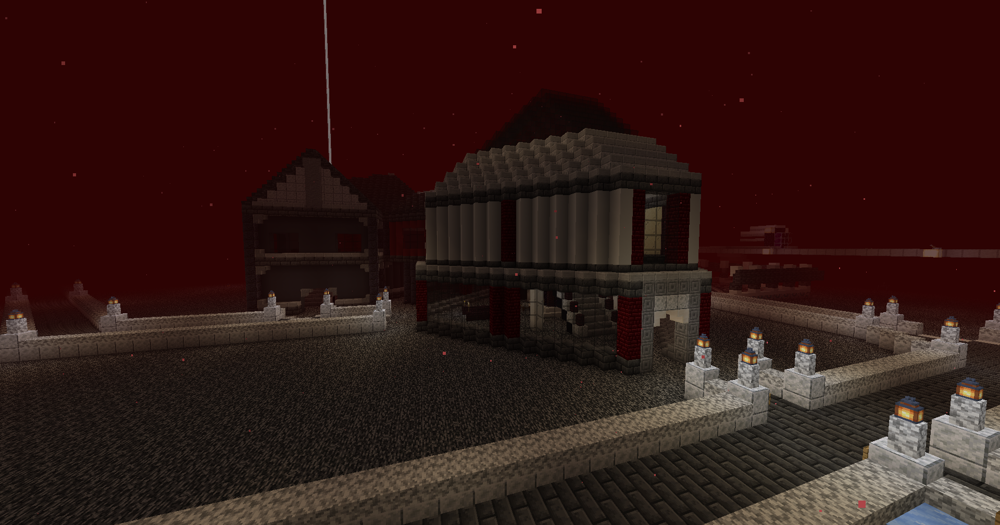

# Travel

## Warp Menu

<figure><figcaption>
Warp menu at spawn
</figcaption></figure>

At spawn, click on the Enderman NPC labelled "Warps". From there, you can select between worlds or landmarks. You can teleport to the Nether, End, and Flatworld.

### Bed Warp

<figure><figcaption>
The Bed Warp
</figcaption></figure>

Once you get your start on Torrent SMP, make sure to set your spawn in a bed ASAP! Until you set up a [nether highway](travel.md#nether-hub), or manage to get your base listed on the warp menu, this will be your primary method of travel back to your base if there's nobody online to TPA to. We do not use `/home` to ensure the closest we can get to a Vanilla feel with all of our extra-game content, so this is a necessary compromise to ensure a smooth gameplay experience.

## Flatworld

The Flatworld is a WIP world containing custom mobs and a wide open area for exploration. There are 8 total layers: 4 dirt and 4 stone beneath the surface. All mobs are enabled except for slimes. All structures are enabled except strongholds, which means it's much easier to find generated structures like trial chambers in this world. It's recommended to be a decently high level, so take heed!

## Landmarks

There are many landmarks on the server that can be warped to from the Warp Menu. This includes Clockwork City, Trident Town, the Hobbit Hole, and much more. Much of these landmarks were built by players on Torrent SMP, and gained enough notoriety and attraction to be turned into a server warp. These warps were previously located in our proprietary Teleportation Hub.


For a player base or district to be turned into a warp, at least one half of the staff team must vote for its addition. Create a ticket in our Discord, and give us the coordinates and screenshots of the area. Sell the potential warp's features to our staff!


## Nether Hub

<figure><figcaption>
Nether Hub
</figcaption></figure>

At coordinates 0/0 on the Nether Roof, you can find the Nether Hub. Many pathways, ice boat roads, rail lines, and other modes of travel branch off from the Nether Hub as the central node in the highway system. You can see the highway system in its full glory on the [live map](https://map.torrentsmp.com/#quantum_nether_roof:128:0:-96:1500:0:0:0:1:flat). To make a portal to your base here, first note down the coordinates of your base and divide them by 8. This will be the coordinates for your nether portal. You can even use a [nether portal calculator](https://maximumfx.nl/portal/en/) to do so.

Build your pathway, rail line, or ice boat road bridging off from an existing road if needed, ensuring easy travel back to the Nether Hub. Congrats! You now have an easy and quick way back to your base.

## Other Modes of Travel

* You can use `/tpa` to send a teleport request to other players
* You can use `/tpahere` to request a player to teleport to you
* You can use `/tpaccept` and `/tpdeny` to accept or deny a teleportation request
* You can use `/mail new`, write a request to build a teleportation chamber using catstone (proprietary) or ender pearl statis chambers (fully Vanilla mind you) and use `/mail send kiokugames` to get our chief redstone engineer on the case.
